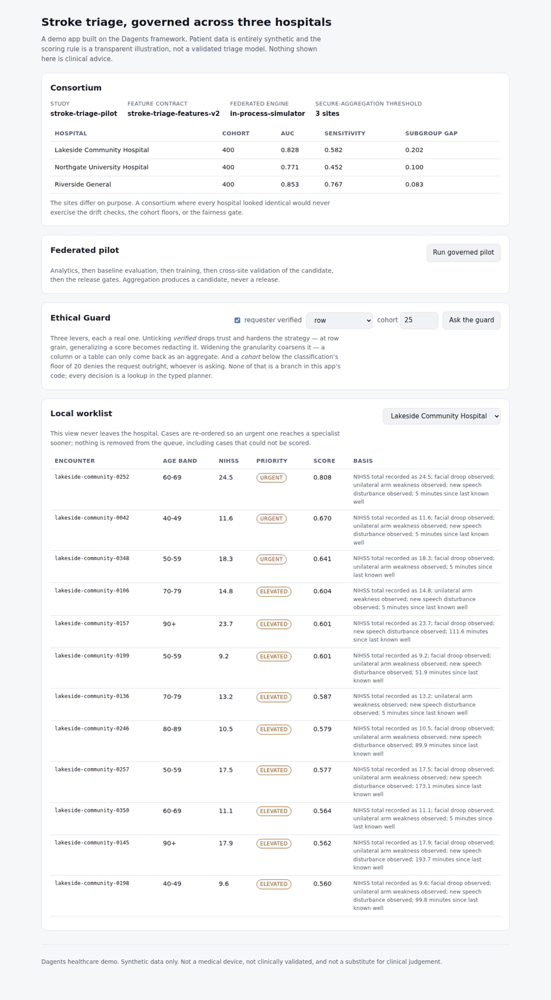
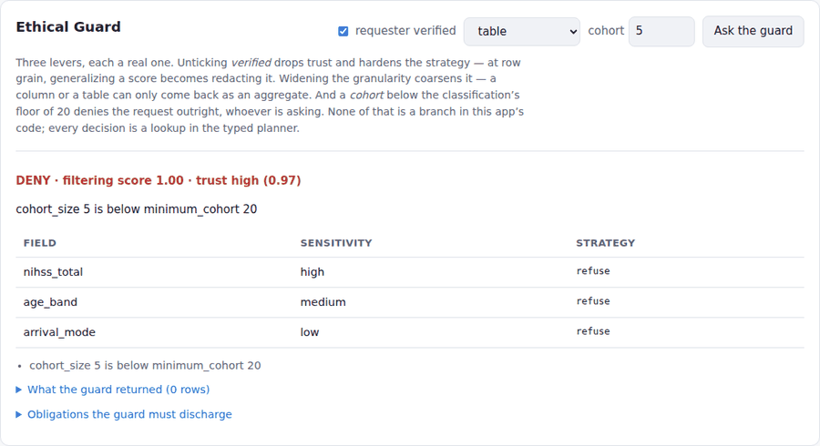
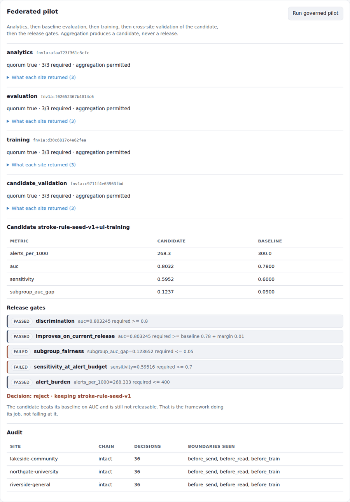

# Dagents healthcare demo: governed federated stroke triage

A demo application built on the [Dagents](../../README.md) framework. Three hospitals improve and
evaluate one stroke-triage model without any of them sending patient records anywhere.

> **All patient data here is synthetic and generated at runtime. The scoring rule is a transparent
> illustration, not a validated triage model. Nothing this app produces is clinical advice, and none
> of it is a medical device.** See [Honest limits](#honest-limits).

## What this demonstrates

The interesting claim is not "federated learning works". It is that the hard parts — deciding what
may leave a hospital, proving a site can refuse, holding a candidate model back until it clears its
safety gates — can live in a reusable framework rather than being rebuilt per project.

Run the pilot (`scripts/run_pilot.sh`, default cohort of 400 per hospital) and the framework
rejects the candidate:

```text
Release gates
  [PASS] discrimination               auc=0.803245 required >= 0.8
  [PASS] improves_on_current_release  auc=0.803245 required >= baseline 0.78 + margin 0.01
  [FAIL] subgroup_fairness            subgroup_auc_gap=0.123652 required <= 0.05
  [FAIL] sensitivity_at_alert_budget  sensitivity=0.59516 required >= 0.7
  [PASS] alert_burden                 alerts_per_1000=268.333 required <= 400

Decision   : REJECT
  rollback : stroke-rule-seed-v1
```

The candidate beats its baseline and is still not releasable. That is the framework working, not
failing: aggregation creates a candidate, never an approved release.

### The privacy cost is visible in those numbers

`nihss_total` is classified high-sensitivity, so when a site reads it for the coordinator's job the
Guard generalizes it — the round's code sees the score coarsened, not the exact value. That costs
about 0.014 AUC against scoring the raw values.

This is the tradeoff the architecture is about, and it is better seen than argued. If a consortium
decides that cost is too high, the lever is the classification, not the code: change what
`nihss_total`'s sensitivity is, and the Rails re-derive the strategy without a single code path
changing.

## Quick start

The only hard dependency is the OCaml planner. Build it once:

```bash
cd ../../bindings/ocaml && opam exec -- dune build ./bin/dagentsc.exe
```

Then, from this directory:

```bash
scripts/run_frontend_demo.sh      # the whole demo: API, UI, and a guided tour
scripts/run_frontend_demo.sh --check   # start it, run the UI smoke test, exit
scripts/run_pilot.sh              # no UI: run one pilot and print the evidence
```

`run_frontend_demo.sh` starts the backend, starts the frontend in front of it, waits until both
actually answer, and prints what to click and what each panel is showing. Ctrl-C stops both.

No Docker, no database, and no model download. For the full stack including the framework services:

```bash
docker compose -f docker-compose.yml --env-file ../../env/.env.compose up --build
```

### Why the planner is required

The Ethical Guard **fails closed**. Without `dagentsc` it cannot ask what protection a request
needs, so it denies the request rather than allowing it. That is the correct behaviour and it also
means nothing useful runs, which is why the scripts check for the binary and say so.

## The UI



Four panels, in the order worth reading them.

### Ethical Guard — the fastest way to see the governance layer

Three levers, each a real one. Change any of them and press **Ask the guard**; watch the strategy
column rather than just the verdict.

| Change | `nihss_total` strategy | What it shows |
|---|---|---|
| verified, row | `generalize:1` | a trusted caller still gets a coarsened score |
| **untick verified**, row | `redact` | lower trust hardens the strategy |
| verified, **table** | `aggregate_only:20` | a table can only come back as a group |
| verified, **model update** | `clip_contribution:1` | an update is bounded, never raw |
| verified, **cohort 5** | `refuse` → **DENY** | below the floor of 20, nobody gets it |



The fourth row is the extension this project adds to the published GRAILS framework: a model update
is not a row, but it still carries patient signal, so it is governed as a fifth granularity and
never resolves to "release unchanged".

None of those decisions is a branch in this app's code — every one is a lookup in the typed OCaml
planner. Changing the policy means editing a classification, not a code path.

### Federated pilot



Press **Run governed pilot** and four rounds run: analytics, baseline evaluation, training, then
cross-site validation of the candidate. Each shows its manifest digest, its quorum, and any site
excluded with the reason.

Then read the gates, and open *What each site returned*: counts, a bounded norm, approved metrics,
and a pointer that resolves only at the site. There is no patient-level column, and a test asserts
there never is one.

## How it works

```text
                         ┌──────────────────────────────────────────┐
  Consortium boundary    │ GMA · round control, release governance  │
                         │ federation_compiler · governance_compiler│
                         └────────────┬─────────────────────────────┘
                     signed round job │  bounded update + approved metrics
      ┌───────────────────────────────┼───────────────────────────────┐
      │                               │                               │
┌─────┴──────────┐            ┌───────┴────────┐            ┌─────────┴──────┐
│ Riverside      │            │ Northgate      │            │ Lakeside       │
│ LMA + Guard    │            │ LMA + Guard    │            │ LMA + Guard    │
│ synthetic EHR  │            │ synthetic EHR  │            │ synthetic EHR  │
└────────────────┘            └────────────────┘            └────────────────┘
   records stay here             records stay here             records stay here
```

A pilot runs four rounds, in the order a real study should:

1. **Analytics** — prove every site produces the same measures before anything is trained.
2. **Evaluation** — how the seed rule performs at each site today.
3. **Training** — sites contribute; the outcome label is stripped, because a training round has no
   business reading what it is meant to anticipate.
4. **Candidate validation** — the candidate is tested at each hospital. Its metrics come from here,
   not from the round that produced it.

Then the release gates decide, and a human committee decides after that.

### What crosses a boundary

Everything a site returns, and nothing else:

| Field | Why it is allowed |
|---|---|
| `contributed_examples` | a count, not a cohort |
| `update_norm` | a magnitude, clipped by the Guard before it leaves |
| `metrics` | approved aggregate measures, agreed in the feature contract |
| `participation`, `code_verified`, `privacy_checks_passed` | round status |
| `local_evidence_pointer` | an address at the site, resolvable only there |

There is a test that asserts no encounter id, age band, NIHSS score, glucose value or outcome label
appears in a site result. If it ever fails, this README is lying.

## The framework/app boundary

This is the point of the repository split, so it is worth being precise. `backend/app/extension.py`
is the entire integration surface — about eighty lines, all declarative.

| The framework owns | This app owns |
|---|---|
| Source and schema validation | The stroke feature contract, its units and terminology |
| Data-quality rule evaluation | Which clinical rules matter and at what severity |
| Restriction planning (the GRAILS Rails) | Which fields are sensitive, under which regulations |
| Guard enforcement and the audit chain | The approved purposes a request may declare |
| Round planning, quorum, aggregation readiness | Which hospitals, which condition, which seed |
| Release gate evaluation | Which gates this condition requires, and their thresholds |
| Pipeline DAG planning, workload compilation | FHIR and HL7 mapping into the contract |
| — | The triage rule, its thresholds, and its intended-use statement |

Nothing in `agents/` knows what a stroke is. Nothing here re-implements a quorum rule. Adding a
second condition means another `ConditionPack`, not a framework change — which is why the framework
changes for this app were about governance and federation in general, never about healthcare.

`GET /api/v1/extension` returns this table from the running app, derived from the registry rather
than written out by hand.

### One platform, separate clinical applications

The platform is reusable across conditions. The clinical application is not. `GET
/api/v1/conditions` lists one implemented condition and four planned ones, each marked
`not implemented` with what it would still need: its own cohort definition, feature contract, model
or ruleset, thresholds, workflow, owner, and safety evidence.

Declaring them rather than omitting them keeps the claim narrow on purpose.

## API

| Endpoint | What it does |
|---|---|
| `GET /api/v1/overview` | the consortium, its hospitals, and the release gates |
| `GET /api/v1/conditions` | what is implemented and what deliberately is not |
| `GET /api/v1/extension` | exactly what this app contributes to the framework |
| `POST /api/v1/pilot:run` | run the governed pilot; returns all the evidence |
| `POST /api/v1/governance:probe` | ask the Guard a question and see the decision |
| `POST /api/v1/triage:assess` | score one record, with the basis for the recommendation |
| `POST /api/v1/ingest:fhir` | map a FHIR bundle into the feature contract |
| `GET /api/v1/hospitals/{id}/worklist` | one hospital's ranked worklist |
| `GET /api/v1/hospitals/{id}/thresholds` | the sensitivity / alert-burden tradeoff |
| `GET /api/v1/hospitals/{id}/audit` | that hospital's guard decisions and chain state |
| `GET /api/v1/framework/trace` | stroke records through each framework planner |
| `GET /api/v1/framework/status` | which framework services are reachable |

The guard probe is the quickest way to see the governance layer: flip *requester verified* off, or
change the granularity to `table`, and the decision changes — because the decision is a lookup in a
typed planner, not a branch in this app's code.

## Tests

Inside the Dagents repository:

```bash
PYTHONPATH=../..:backend ../../.venv/bin/python -m unittest discover -s tests -t .
```

Extracted into its own repository, tell the suite where the framework is:

```bash
DAGENTS_HOME=~/src/Dagents PYTHONPATH=$DAGENTS_HOME:backend python -m unittest discover -s tests -t .
```

39 tests. The governed ones run against the real `dagentsc` binary rather than a stub: stubbing the
planner would prove the app calls something, not that the governance holds. **Check the skip
count** — without the planner, most of them skip and the suite still reports `OK`, which is green
without having proved anything.

The frontend has its own smoke test, because a typecheck and a bundle prove the app compiles and
nothing about whether it renders, whether the proxy reaches the backend, or whether the governance
controls change anything:

```bash
scripts/run_frontend_demo.sh --check     # starts the stack, runs it, tears down
cd frontend && npm run smoke             # against an already-running stack
```

It drives all three guard levers, runs a full pilot, and fails on any console error or failed
request. Without a browser it exits 2 and reports `SKIP` rather than passing quietly.

The ones worth reading first are in `tests/test_federated_pilot.py`:
`test_no_patient_level_data_crosses_the_boundary`,
`test_the_full_pilot_rejects_a_candidate_that_fails_a_safety_gate`, and
`test_a_training_round_never_reads_the_outcome_label`.

## Layout

```text
backend/app/
  extension.py         the entire Dagents integration surface
  domain/
    conditions.py      feature contract, classification, condition pack, release gates
    stroke_rule.py     the transparent scoring rule and its evaluation
    fhir.py            FHIR-shaped ingestion into the contract
    synthetic.py       synthetic patients; three deliberately different hospitals
  services/
    hospital.py        one hospital as a federated site, with its Guard
    consortium.py      the governed pilot across all three
    framework_client.py  reaching Dagents services and planners
  main.py              FastAPI surface
frontend/
  src/App.tsx          the operator UI (Vite + React)
  smoke.mjs            drives the UI against a live backend
docs/screenshots/      what the UI looks like, regenerated by the smoke test
scripts/               run the demo, run the pilot, split into its own repo
tests/                 39 tests
```

## Standing this up as its own repository

```bash
scripts/extract_repo.sh ~/src/dagents-healthcare-demo
```

`git subtree split` keeps this directory's history. Afterwards the app still imports the framework,
so set `DAGENTS_HOME` to a Dagents checkout with the planner built, or install Dagents as a
dependency.

## Honest limits

Worth stating plainly, because a demo about safety controls that overstated itself would be the
wrong kind of demo.

- **The data is synthetic.** Generated at runtime from seeded distributions. Any AUC reported here
  measures how the generator was written, not how stroke triage behaves.
- **The rule is not a model.** It is a weighted score over documented stroke warning signs, chosen
  so a reader can predict its output from its inputs. It has had no clinical validation of any kind.
- **The federated engine is a simulator.** Every site runs in one process. That proves job logic and
  proves nothing about production privacy, security, reliability or network behaviour. A deployment
  swaps in an adapter for NVIDIA FLARE or another approved runtime.
- **Digests are not signatures.** The round digest is a deterministic content hash that detects
  drift. It carries no authenticity guarantee; supply-chain signing is separate work.
- **Audit chaining is not an audit store.** Records are chained so tampering is detectable in a test.
  Production needs append-only storage, retention rules, and signing.
- **Noise is not differential privacy.** The Guard's `add_noise` strategy shows where a privacy
  mechanism belongs in the pipeline. A real deployment needs a privacy accountant and a tracked
  budget.
- **Architecture is not compliance.** HIPAA and SOC 2 include administrative and physical safeguards,
  operating effectiveness, and independent examination. No codebase provides those.

## Reading

- [`docs/presentation/healthcare-case-study/`](../../docs/presentation/healthcare-case-study/) — the
  case study and the federated use case this app implements
- [`bindings/ocaml/README.md`](../../bindings/ocaml/README.md) — the planner modules, including
  `governance_compiler` and `federation_compiler`
- Kulkarni and Ramanathan, "GRAILS — A Framework for Embedding Ethical Safeguards in Software
  Applications for Responsible AI", AIES 2025
