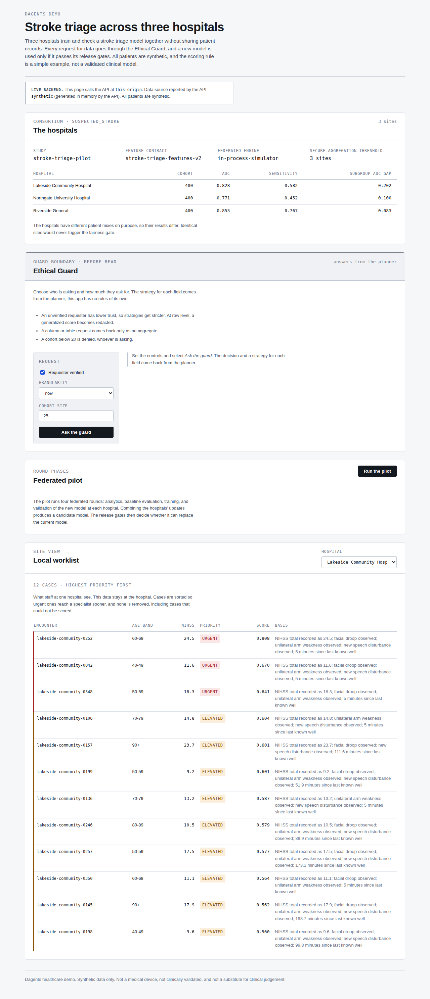
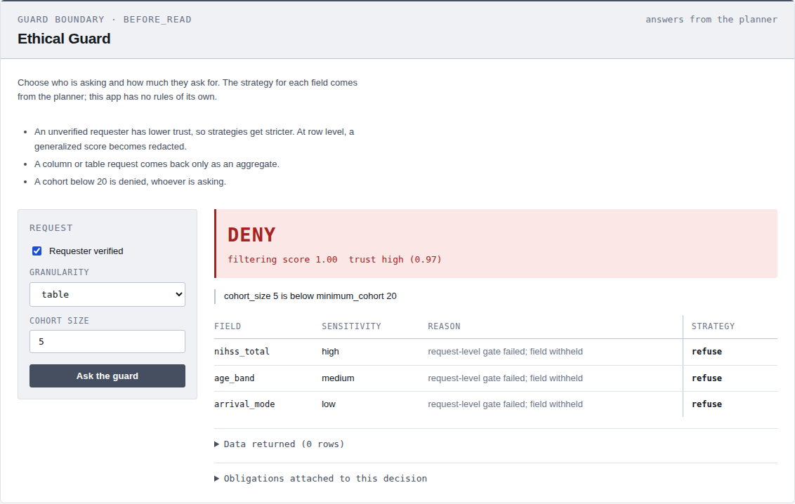
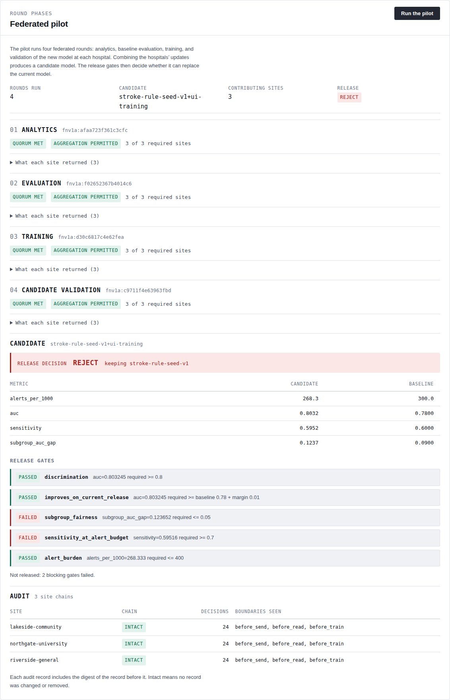
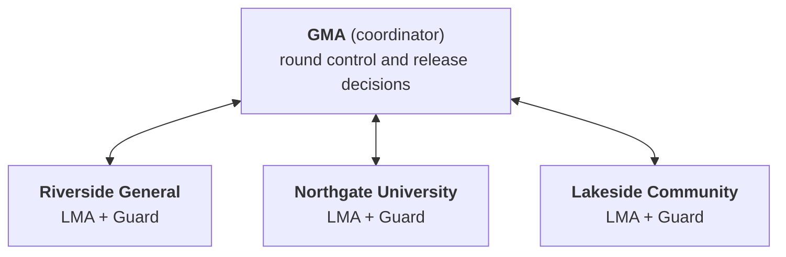

# Dagents healthcare demo: stroke triage across three hospitals

A demo application built on the [Dagents](../../README.md) framework. Three
hospitals improve and evaluate one stroke triage model without sending patient
records anywhere.

> **All patient data is synthetic.** A local run generates it in memory. The
> deployed demo reads it from a database that the same generator filled. The
> scoring rule is a simple, readable example, not a validated triage model.
> Nothing this app produces is medical advice, and it is not a medical device.
> See [Limits](#limits).

**Live:** <https://pradyunuydarp.github.io/Dagents/healthcare-demo/>, calling
<https://dagents-healthcare-api.onrender.com/api/v1/health>.

The deployed page reads its patient records from Postgres through the
framework's source adapter. The OCaml planner in the API image makes every
governance and federation decision, so the strategies, denials and gate results
on screen come from the planner. The page shows the data source the API reports.
The API sleeps after about 15 minutes without traffic, so the first request
takes about 20 seconds, with a banner while it waits.

A local run needs no database and no account; the patient records are generated
in memory. See [Quick start](#quick-start), and
[`docs/deployment.md`](docs/deployment.md) for the deployed parts.

## What this demonstrates

The hard parts of a federated study are deciding what may leave a hospital,
letting a site refuse, and holding a new model back until it passes its safety
checks. This demo shows that those parts can live in a reusable framework
instead of being rebuilt for each project.

Run the pilot (`scripts/run_pilot.sh`, 400 patients per hospital by default).
The framework rejects the new model:

```text
Release gates
  [PASS] discrimination               auc=0.803245 required >= 0.8
  [PASS] improves_on_current_release  auc=0.803245 required >= baseline 0.78 + margin 0.01
  [FAIL] subgroup_fairness            subgroup_auc_gap=0.123652 required <= 0.05
  [FAIL] sensitivity_at_alert_budget  sensitivity=0.59516 required >= 0.7
  [PASS] alert_burden                 alerts_per_1000=268.333 required <= 400

Decision   : REJECT
  rollback : stroke-rule-seed-v1
```

The candidate scores higher than the current model, but it fails two blocking
gates, so it is not released. Aggregation produces a candidate; only the gates
can approve a release.

### The cost of privacy, measured

`nihss_total` (the NIH Stroke Scale score) is classified as high sensitivity.
When a site reads it for the coordinator's job, the Guard generalizes it, so the
round's code sees a rounded score instead of the exact value. Across the three
hospitals this lowers the AUC from 0.817 (exact scores) to 0.804 (generalized),
a cost of about 0.014.

If a consortium finds that cost too high, it changes the classification, not the
code. Lower `nihss_total`'s sensitivity and the planner chooses a different
strategy; no code path changes.

## Quick start

The only hard dependency is the OCaml planner. Build it once:

```bash
cd ../../bindings/ocaml && opam exec -- dune build ./bin/dagentsc.exe
```

Then, from this directory:

```bash
scripts/run_frontend_demo.sh           # the whole demo: API, UI and a guided tour
scripts/run_frontend_demo.sh --check   # start it, run the UI smoke test, exit
scripts/run_pilot.sh                   # no UI: run one pilot and print the results
```

`run_frontend_demo.sh` starts the backend and the frontend, waits until both
answer, and prints what to try in each panel. Press Ctrl-C to stop both.

A local run needs no Docker, database or model download. The deployed demo reads
its records from Postgres instead, and reports which source it uses at
`/api/v1/framework/status`; see [`docs/deployment.md`](docs/deployment.md).

To run the full stack, including the framework services:

```bash
docker compose -f docker-compose.yml --env-file ../../env/.env.compose up --build
```

### Why the planner is required

The Ethical Guard **fails closed**. Without `dagentsc` it cannot ask what
protection a request needs, so it denies every request. That is correct, but it
means nothing useful runs, so the scripts check for the binary first.

## The UI



### Ethical Guard

The fastest way to see the governance layer. Change a control, select **Ask the
guard**, and compare the strategy for `nihss_total`:

| Change | `nihss_total` strategy | What it shows |
|---|---|---|
| verified, row | `generalize:1` | a trusted requester still gets a rounded score |
| **untick verified**, row | `redact` | lower trust gives a stricter strategy |
| verified, **table** | `aggregate_only:20` | a table comes back only as a group |
| verified, **model update** | `clip_contribution:1` | an update is bounded, never raw |
| verified, **cohort 5** | `refuse` → **DENY** | below the minimum of 20, nobody gets it |



The model update row is this project's addition to the published GRAILS
framework. A model update is not a row, but it still carries information about
patients, so it is governed as a fifth granularity and is never released
unchanged.

The app has no rules of its own here. Every decision comes from the OCaml
planner, and changing the policy means editing a classification.

### Federated pilot



Select **Run the pilot** and four rounds run: analytics, baseline evaluation,
training, and validation of the candidate at each hospital. Each round shows its
manifest digest, whether it reached quorum, and any excluded site with the
reason.

Then read the gates, and open *What each site returned*: counts, a bounded
update size, approved metrics and a pointer to evidence that stays at the site.
No column describes a single patient, and a test checks that none ever does.

## How it works


```mermaid
flowchart TB
    GMA["<b>GMA</b> (coordinator)<br/>round control and release decisions"]
    R["<b>Riverside General</b><br/>LMA + Guard"]
    N["<b>Northgate University</b><br/>LMA + Guard"]
    L["<b>Lakeside Community</b><br/>LMA + Guard"]
    GMA <--> R & N & L
```

Patient records stay at each hospital. The GMA sends each round job with its
manifest digest, and each site returns only a bounded update and approved
metrics.

A pilot runs four rounds, in the order a real study would:

1. **Analytics**: check that every site produces the same measures before
   anything is trained.
2. **Evaluation**: measure how the current rule performs at each site.
3. **Training**: sites contribute updates. The outcome label is removed, because
   a training round must not read the outcome it learns to predict.
4. **Candidate validation**: test the candidate at each hospital. Its metrics
   come from this round, not from the round that produced it.

Then the release gates decide, and after that a human committee.

### What leaves a site

A site returns these fields and nothing else:

| Field | Why it is allowed |
|---|---|
| `contributed_examples` | a count, not a list of patients |
| `update_norm` | the size of the update, clipped by the Guard before it leaves |
| `metrics` | aggregate measures approved in the feature contract |
| `participation`, `code_verified`, `privacy_checks_passed` | round status |
| `local_evidence_pointer` | an address at the site, readable only there |

A test checks that no encounter id, age band, NIHSS score, glucose value or
outcome label appears in a site result.

## What the framework owns and what the app owns

`backend/app/extension.py` is the whole integration: about eighty declarative
lines.

| The framework owns | This app owns |
|---|---|
| Source and schema validation | The stroke feature contract, its units and terms |
| Data quality rule evaluation | Which clinical rules matter, and how severe each is |
| Restriction planning (GRAILS) | Which fields are sensitive, under which regulations |
| Guard enforcement and the audit chain | The approved purposes a request may declare |
| Round planning, quorum, aggregation readiness | Which hospitals, which condition, which starting model |
| Release gate evaluation | Which gates this condition needs, and their thresholds |
| Pipeline DAG planning, workload compilation | FHIR and HL7 mapping into the contract |
| — | The triage rule, its thresholds and its intended-use statement |

Nothing in `agents/` knows what a stroke is, and nothing here implements a quorum
rule. A second condition needs another `ConditionPack`, not a framework change.
The framework changes made for this app were about governance and federation in
general, never about healthcare.

`GET /api/v1/extension` returns this table from the running app, built from the
extension registry.

### One platform, separate clinical applications

The platform can be reused across conditions; the clinical application cannot.
`GET /api/v1/conditions` lists one implemented condition and four planned ones.
Each planned one is marked `not implemented` and lists what it still needs: its
own cohort definition, feature contract, model or rules, thresholds, workflow,
owner and safety evidence.

## API

| Endpoint | What it does |
|---|---|
| `GET /api/v1/overview` | the consortium, its hospitals and the release gates |
| `GET /api/v1/conditions` | which conditions are implemented and which are planned |
| `GET /api/v1/extension` | what this app contributes to the framework |
| `POST /api/v1/pilot:run` | run the pilot and return every round, gate and audit chain |
| `POST /api/v1/governance:probe` | send one request through the Guard and see the decision |
| `POST /api/v1/triage:assess` | score one record, with the reasons |
| `POST /api/v1/ingest:fhir` | map a FHIR bundle into the feature contract |
| `GET /api/v1/hospitals/{id}/worklist` | one hospital's ranked worklist |
| `GET /api/v1/hospitals/{id}/thresholds` | the trade-off between sensitivity and alert burden |
| `GET /api/v1/hospitals/{id}/audit` | that hospital's guard decisions and chain state |
| `GET /api/v1/framework/trace` | stroke records through each framework planner |
| `GET /api/v1/framework/status` | the data source, and which framework services are reachable |

[Step 4 of the learning guide](../../docs/learn/04-apis.md) walks through these
calls against the deployed API.

## Tests

Inside the Dagents repository:

```bash
PYTHONPATH=../..:backend ../../.venv/bin/python -m unittest discover -s tests -t .
```

In its own repository, tell the suite where the framework is:

```bash
DAGENTS_HOME=~/src/Dagents PYTHONPATH=$DAGENTS_HOME:backend python -m unittest discover -s tests -t .
```

The governance tests run against the real `dagentsc` binary, not a stub, because
a stub would only prove that the app calls something. **Check the skip count.**
Without the planner, most of these tests skip and the suite still reports `OK`.

The frontend has a browser smoke test, because a typecheck and a bundle only
prove that the app compiles:

```bash
scripts/run_frontend_demo.sh --check     # starts the stack, runs the test, stops
cd frontend && npm run smoke             # against a running stack
```

It tries all three guard controls, runs a full pilot, and fails on any console
error or failed request. Without a browser it exits 2 and prints `SKIP`.

Good tests to read first, in `tests/test_federated_pilot.py`:
`test_no_patient_level_data_crosses_the_boundary`,
`test_the_full_pilot_rejects_a_candidate_that_fails_a_safety_gate` and
`test_a_training_round_never_reads_the_outcome_label`.

## Layout

```text
backend/app/
  extension.py         the whole Dagents integration
  domain/
    conditions.py      feature contract, classification, condition pack, release gates
    stroke_rule.py     the readable scoring rule and its evaluation
    fhir.py            FHIR-shaped ingestion into the contract
    synthetic.py       synthetic patients; three hospitals that differ on purpose
  services/
    hospital.py        one hospital as a federated site, with its Guard
    consortium.py      the pilot across all three
    framework_client.py  calls to Dagents services and planners
  main.py              FastAPI app
frontend/
  src/App.tsx          the UI (Vite + React)
  smoke.mjs            drives the UI against a live backend
docs/screenshots/      screenshots of the UI, taken by the smoke test
scripts/               run the demo, run the pilot, move into its own repository
tests/                 the test suite
```

## Moving it into its own repository

```bash
scripts/extract_repo.sh ~/src/dagents-healthcare-demo
```

`git subtree split` keeps this directory's history. The app still imports the
framework afterwards, so set `DAGENTS_HOME` to a Dagents checkout with the
planner built, or install Dagents as a dependency.

## Limits

- **The data is synthetic.** It is generated from seeded distributions, so any
  AUC here measures the generator, not real stroke triage.
- **The rule is not a trained model.** It is a weighted score over documented
  stroke warning signs, chosen so a reader can predict its output. It has had no
  clinical validation.
- **The federation engine is a simulator.** All sites run in one process. That
  tests the job logic, not production privacy, security, reliability or
  networking. A deployment would plug in NVIDIA FLARE or another approved
  runtime.
- **Digests are not signatures.** The round digest is a content hash that
  detects changes. It does not prove who sent the round; signing is separate work.
- **The audit chain is not an audit store.** Chaining makes tampering detectable
  in a test. Production needs append-only storage, retention rules and signing.
- **Noise is not differential privacy.** The Guard's `add_noise` strategy shows
  where a privacy mechanism belongs. A real deployment needs a privacy
  accountant and a tracked privacy budget.
- **Architecture is not compliance.** HIPAA and SOC 2 also require
  administrative and physical safeguards, proof that controls work in practice,
  and independent audits. No codebase provides those.

## Reading

- [`docs/deployment.md`](docs/deployment.md): the encounter store, the deployed
  API, where each credential is kept, and what the publish check refuses
- [`docs/learn/`](../../docs/learn/README.md): the learning guide, from
  federated learning basics to the APIs
- [`docs/presentation/healthcare-case-study/`](../../docs/presentation/healthcare-case-study/):
  the case study and the federated use case this app implements
- [`bindings/ocaml/README.md`](../../bindings/ocaml/README.md): the planner
  modules, including `governance_compiler` and `federation_compiler`
- Kulkarni and Ramanathan, [GRAILS: A Framework for Embedding Ethical Safeguards
  in Software Applications for Responsible AI](https://ojs.aaai.org/index.php/AIES/article/view/36650),
  AIES 2025
