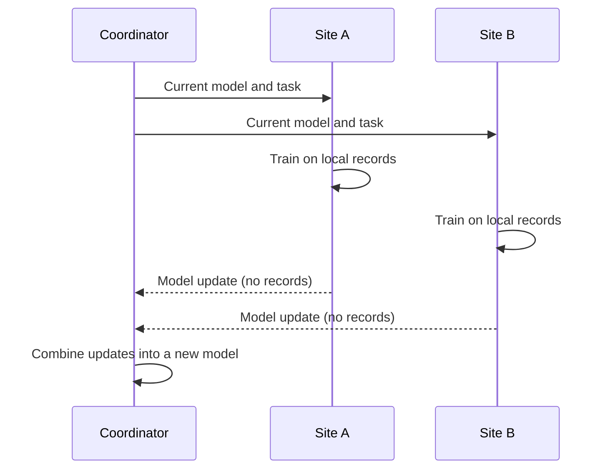

# Step 1: Federated learning

## The problem

Useful data is often split across organizations that cannot share it. Hospitals,
banks and phone owners all hold records that would improve a model, but laws,
contracts and trust prevent copying those records into one place. A model trained
on one hospital's data alone often works poorly at another hospital.

## The idea

Federated learning trains one shared model without moving the raw data. The model
goes to the data instead:

1. A coordinator sends the current model to each site.
2. Each site trains the model on its own records.
3. Each site sends back an update, such as new model weights. The records stay at the site.
4. The coordinator combines the updates into a new model.
5. The cycle repeats. Each cycle is called a **round**.

Google introduced the term in 2016 ([McMahan et al.](https://arxiv.org/abs/1602.05629)).



## Federated averaging

The most common way to combine updates is **federated averaging** (FedAvg). Each
site *k* trains on its *n_k* records and returns weights *w_k*. The coordinator
takes the average, weighted by how much data each site has:

```text
w_new = sum over sites k of (n_k / n) * w_k        where n is the total number of records
```

Sites usually train for several steps before they send anything. This cuts down on
communication: the original paper reports 10 to 100 times fewer communication
rounds than a basic federated version of stochastic gradient descent.

## Federated analytics

Not every question needs a model. **Federated analytics** computes statistics such
as counts, rates and averages in the same way: each site computes locally and only
the totals leave ([Google Research, 2020](https://research.google/blog/federated-analytics-collaborative-data-science-without-data-collection/)).

Dagents has three kinds of round: analytics, evaluation and training. The stroke
triage demo runs an analytics round first, to check that every site can produce
the same measures before anything is trained.

## Two settings

| Setting | Participants | Example |
|---|---|---|
| Cross-device | Millions of phones, each with a little data, often offline | Keyboard suggestions on Android |
| Cross-silo | A few organizations, each with a lot of data, usually online | Hospitals training a diagnosis model |

Dagents is built for the cross-silo setting.

## Common problems

| Problem | What it means |
|---|---|
| Different data at each site | Sites serve different populations, so local models disagree. This is often called non-IID data. |
| Communication cost | Sending models back and forth is slow, so rounds are expensive. |
| Dropouts | Some sites are slow or go offline during a round. |
| Updates can leak information | A model update can reveal facts about the records it was trained on. Step 2 covers the protections. |
| Agreement on what runs | Sites need to check that the code and the model they receive are the ones that were approved. |

## How this maps to Dagents

| Concept | In Dagents |
|---|---|
| Site | LMA (local monitoring agent), one per data source |
| Coordinator | GMA (global monitoring agent) |
| Round contract | A round manifest. Each site checks its digest before accepting the work. |
| Combining updates | FedAvg, FedProx, FedOpt or secure aggregation, chosen in the manifest |
| Checking the result | Release gates decide whether a candidate model can be released |

The federation engine included in Dagents runs everything in one process. It is a
simulator for tests and demos. A real deployment would put a federated learning
runtime, such as [Flower](https://flower.ai/docs/framework/tutorial-get-started-with-flower-pytorch.html)
or [NVIDIA FLARE](https://nvflare.readthedocs.io/), behind the `FederationEngine`
interface.

## Watch

- [Federated Learning: Machine Learning on Decentralized Data](https://www.youtube.com/watch?v=89BGjQYA0uE) — Google I/O 2019. An introduction from Google's federated learning team.
- [On Heterogeneity in Federated Settings](https://www.youtube.com/watch?v=laCyJICLyWg) — Virginia Smith, Stanford MLSys Seminar. Why different data at each site makes training harder.
- [Introduction to Federated Learning and Privacy-preserving ML with Flower](https://www.youtube.com/watch?v=rwi3SamXpPY) — Flower, session 1.
- [Intro to Federated Learning](https://www.deeplearning.ai/short-courses/intro-to-federated-learning/) — DeepLearning.AI short course with Flower Labs. About an hour of video with code.

## Read

- [Federated Learning: Collaborative Machine Learning without Centralized Training Data](https://research.google/blog/federated-learning-collaborative-machine-learning-without-centralized-training-data/) — Google Research blog, 2017. Short and readable.
- [Federated Learning comic](https://federated.withgoogle.com/) — Google. A light introduction.
- [Communication-Efficient Learning of Deep Networks from Decentralized Data](https://arxiv.org/abs/1602.05629) — McMahan et al., 2017. The paper that introduced FedAvg.
- [Advances and Open Problems in Federated Learning](https://arxiv.org/abs/1912.04977) — Kairouz et al., 2021. A long survey; the introduction is a good overview of the field.
- [The future of digital health with federated learning](https://doi.org/10.1038/s41746-020-00323-1) — Rieke et al., 2020. Federated learning in healthcare.

## Try

1. Open the [stroke triage demo](https://pradyunuydarp.github.io/Dagents/healthcare-demo/) and run the pilot. Look at the analytics round: three hospitals are selected, and each returns summaries instead of records.
2. Follow the [Flower PyTorch tutorial](https://flower.ai/docs/framework/tutorial-get-started-with-flower-pytorch.html) to train a small federated model on your own machine.

Next: [Step 2 — Privacy and data governance](02-privacy-and-governance.md)
