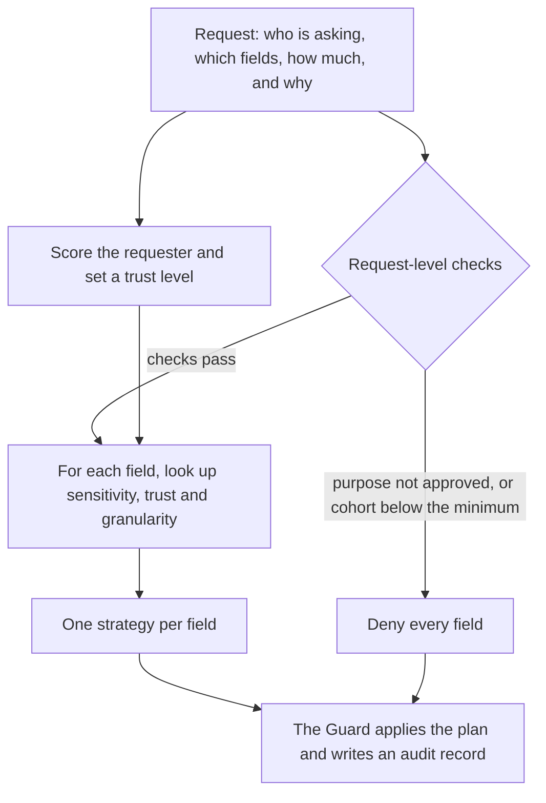

# Step 2: Privacy and data governance

## Why keeping data local is not enough

Federated learning keeps records at each site, but three risks remain:

- **Model updates can leak.** An update can reveal facts about the records it was trained on.
- **Requests can ask for too much.** An analyst might ask for a full table when a count would do.
- **Small groups can identify people.** A statistic about three patients can often be traced back to them.

A governed system therefore decides, for every request, what the requester may see
and in what form.

## Common protections

| Protection | What it does |
|---|---|
| Minimum necessary | Use or share only the data needed for the stated purpose. This is a HIPAA requirement in the US. |
| Generalization | Make a value less precise, for example an exact age becomes an age band. |
| Redaction | Remove a field from the result. |
| Minimum cohort size | Do not release a statistic about fewer than *k* people. This idea comes from k-anonymity. |
| Differential privacy | Add calibrated random noise, so that any one person's data changes the result very little. |
| Contribution clipping | Limit how much any single site's update can change a model. |
| Secure aggregation | The coordinator sees only the sum of all updates, never a single site's update. |

## GRAILS: three inputs decide the protection

[GRAILS](https://ojs.aaai.org/index.php/AIES/article/view/36650) (Kulkarni and
Ramanathan, AIES 2025) chooses a protection for each field from three inputs:

1. **Sensitivity** of the field: low, medium or high.
2. **Trust** in the requester, from a Know-Your-User (KYU) score.
3. **Granularity** of the request: cell, row, column or table.

Dagents implements GRAILS in its governance planner and adds a fifth granularity,
**model update**. That lets the same rules govern what leaves a site during a
federated round.

## How Dagents decides



### 1. Trust

The KYU score combines verified identity attributes and past behaviour:

```text
score = 0.7 * (weighted share of verified attributes) + 0.3 * (compliance history)
```

| Score | Trust |
|---|---|
| below 0.4 | low |
| 0.4 to 0.75 | moderate |
| 0.75 and above | high |

A requester with no attributes scores 0, whatever their history.

### 2. Request-level checks

These apply to the whole request. If one fails, every field is refused.

- The declared purpose must be one of the classification's approved purposes.
- For column, table and model-update requests, the cohort must be at least the
  classification's minimum size. Cell and row requests are not checked against it.

### 3. A strategy for each field

| Strategy | Effect |
|---|---|
| `allow_full` | The field is returned unchanged. |
| `generalize:n` | The value is made less precise. A higher *n* is coarser. |
| `redact` | The field is removed. |
| `aggregate_only:k` | Only aggregates over at least *k* subjects are returned. |
| `clip_contribution:b` | A model update is limited to norm *b*. |
| `add_noise:s` | Noise of scale *s* is added to a model update. |
| `refuse` | The field is withheld. |

Part of the rule table:

| Sensitivity | Trust | Row | Table | Model update |
|---|---|---|---|---|
| High | Low | refuse | refuse | refuse |
| High | Moderate | redact | aggregate_only | add_noise |
| High | High | generalize | aggregate_only | clip_contribution |
| Medium | High | allow_full | aggregate_only | clip_contribution |
| Low | High | allow_full | allow_full | clip_contribution |

A model update always gets some protection, even for low-sensitivity fields and
trusted requesters, because it is derived from the records.

The full table is in
[`bindings/ocaml/lib/governance_compiler`](../../bindings/ocaml/lib/governance_compiler/).
It is written as an exhaustive pattern match, so the code does not compile until
every combination of sensitivity, trust and granularity has a strategy.

### 4. Enforcement and audit

The **Guard** applies the plan to the data and writes an audit record. Each record
includes the digest of the one before it, so editing or deleting a record breaks
every digest after it. This detects tampering in tests; a production system would
also need signed records and append-only storage.

If the planner cannot be reached, the Guard **denies** the request and records the
denial.

## Example

These are real responses from the stroke demo's governance endpoint. The
classification marks `nihss_total` as high sensitivity, `age_band` as medium and
`arrival_mode` as low, with a minimum cohort of 20.

| Request | `nihss_total` | `age_band` | `arrival_mode` | Decision |
|---|---|---|---|---|
| Verified requester, row | generalize:1 | allow_full | allow_full | narrow |
| Unverified requester, row | redact | generalize:1 | allow_full | narrow |
| Verified, table, 25 subjects | aggregate_only:20 | aggregate_only:20 | allow_full | narrow |
| Verified, table, 5 subjects | refuse | refuse | refuse | deny: cohort 5 is below the minimum of 20 |
| Verified, model update | clip_contribution:1 | clip_contribution:1 | clip_contribution:1 | narrow |

The verified requester scored 0.97 (high trust). The unverified one scored 0.445
(moderate trust).

## Watch

- [Protecting Privacy with MATH](https://www.youtube.com/watch?v=pT19VwBAqKA) — minutephysics with the US Census Bureau. A 12-minute introduction to differential privacy.
- [Introduction to Federated Learning and Privacy-preserving ML with Flower](https://www.youtube.com/watch?v=rwi3SamXpPY) — covers privacy in federated systems.

## Read

- [Minimum Necessary Requirement](https://www.hhs.gov/hipaa/for-professionals/privacy/guidance/minimum-necessary-requirement) — US Department of Health and Human Services.
- [k-anonymity](https://dataprivacylab.org/projects/kanonymity/) — Latanya Sweeney, 2002. Why small groups can identify people.
- [The Algorithmic Foundations of Differential Privacy](https://www.cis.upenn.edu/~aaroth/Papers/privacybook.pdf) — Dwork and Roth, 2014. The first three chapters cover the basics.
- [Practical Secure Aggregation for Privacy-Preserving Machine Learning](https://eprint.iacr.org/2017/281) — Bonawitz et al., 2017.
- [GRAILS: A Framework for Embedding Ethical Safeguards in Software Applications for Responsible AI](https://ojs.aaai.org/index.php/AIES/article/view/36650) — Kulkarni and Ramanathan, AIES 2025. The model Dagents' governance planner implements.

## Try

Open the Ethical Guard panel in the [stroke triage demo](https://pradyunuydarp.github.io/Dagents/healthcare-demo/).
Change "verified", the granularity and the cohort size, and compare the strategies.
Each answer comes from the planner. Step 4 shows how to make the same call with `curl`.

Next: [Step 3 — How Dagents is built](03-architecture.md)
