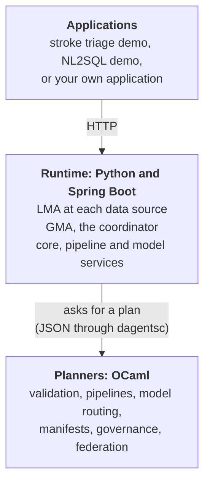
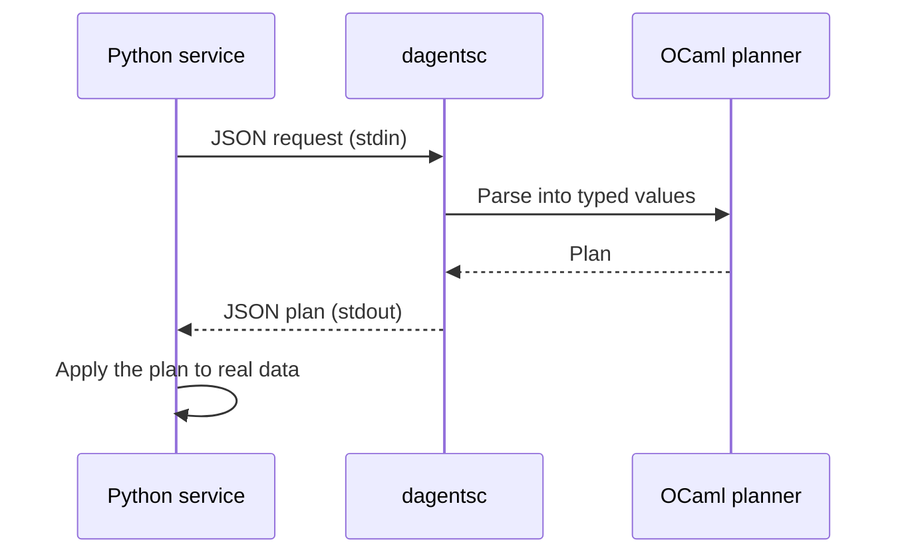
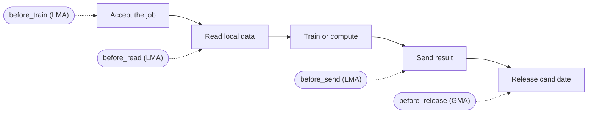
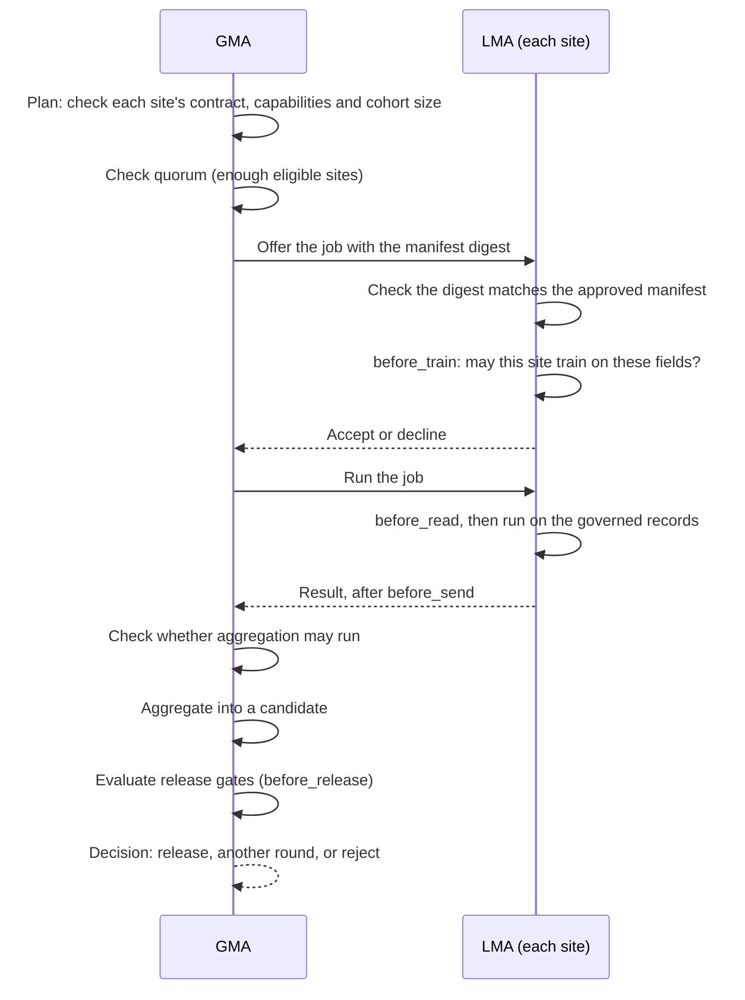
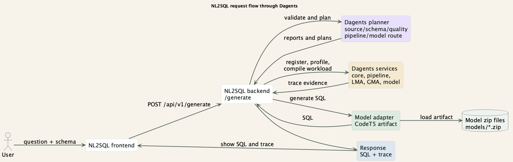

# Step 3: How Dagents is built

Dagents is a framework that other applications use. An application such as the
stroke triage demo supplies its domain knowledge (which fields exist, how
sensitive they are, which conditions it handles). Dagents supplies the rest:
profiling, planning, governance, federated rounds and deployment manifests.

## The layers

What each layer does:

| Layer | Language | Does | Does not |
|---|---|---|---|
| Planners | OCaml | Make decisions from typed inputs: validate, plan, route, render | Open database connections, train models, serve HTTP |
| Runtime | Python | Serve the APIs, read data, train and run models, keep state | Contain the decision rules |
| Orchestration | Java (Spring Boot) | Offer the same control and core APIs to JVM consumers | Run machine learning |

## Why the planners are in OCaml

A planner is a pure function: the same input always gives the same plan, and it
has no side effects. OCaml suits this for two reasons:

- **Algebraic data types.** A choice such as trust level (`LowTrust | ModerateTrust | HighTrust`)
  is a type, not a string. A typo is a compile error.
- **Exhaustive pattern matching.** The compiler checks that every combination is
  handled. Adding a new granularity fails to compile until every rule covers it.

The runtime calls the planners through a command-line program, `dagentsc`. It
sends JSON on standard input and reads a plan from standard output. Using a
separate process, rather than linking the two languages together, keeps failures
isolated and lets each side be upgraded and deployed on its own.

The planner modules:

| Module | Decides |
|---|---|
| `common_ir` | The shared types and their JSON format |
| `dataset_compiler` | Source validation, profiling, schema contracts, quality rules, transforms |
| `pipeline_compiler` | Whether a pipeline is a valid DAG, and the order to run its steps |
| `model_router` | Which model family suits a dataset and task |
| `manifest_compiler` | Kubernetes YAML for a workload |
| `governance_compiler` | What protection a request needs (Step 2) |
| `federation_compiler` | Which sites may join a round, whether quorum is met, whether aggregation may run, and whether a candidate passes its release gates |

## The two agents

**LMA (local monitoring agent).** One runs at each data source: a hospital, a
database, a service. It profiles the local data, runs local work, and applies
governance before data is read, before training, and before anything leaves the
site.

**GMA (global monitoring agent).** It registers the LMAs, plans federated rounds,
combines results, and decides whether a candidate model may be released.

Both agents use the same code layout:

| Folder | Contains |
|---|---|
| `domain/` | Typed models with no I/O |
| `application/` | Use cases |
| `adapters/` | Code that talks to specific technologies |
| `infrastructure/` | Messaging and storage, behind interfaces |

Storage and messaging are in memory today. They sit behind interfaces so they can
be replaced with a database or a message broker later.

## Four guard boundaries

Governance is checked at four points in a round:

| Boundary | Agent | Checks |
|---|---|---|
| `before_train` | LMA | Whether the site may train on the requested fields for this round. Checked when the job is offered. |
| `before_read` | LMA | Which records and fields the job may read. The job runs on this governed data, not the raw records. |
| `before_send` | LMA | What may leave the site: counts, bounded model updates and approved metrics |
| `before_release` | GMA | Whether a candidate model may be released |

## A federated round in Dagents

Two rules always hold, and both have tests:

1. Aggregation produces a **candidate**, never a release. Release needs the gates to pass.
2. A release gate whose metric is missing **blocks** the release. It never passes by default.

The stroke demo runs four rounds in order: analytics, baseline evaluation,
training, and cross-site validation of the candidate. Then it evaluates the
release gates.

## How applications extend Dagents

An application registers an **extension**. It can contribute:

- feature contracts: the fields each site must provide,
- data classifications: how sensitive each field is,
- condition packs: one studied condition with its cohort, approved fields,
  thresholds and release gates,
- named pipeline steps,
- named model adapters.

Two extensions cannot register the same id; that is an error. The stroke demo's
extension is in
[`apps/healthcare-demo/backend/app/extension.py`](../../apps/healthcare-demo/backend/app/extension.py).

A simple test for whether code belongs in the framework: if it needs a
domain-specific word, such as "stroke", it belongs in the application.

### Example: the NL2SQL demo

The NL2SQL demo turns a question into SQL. The app owns its interface and its SQL
model. For each request it asks the planners to validate the source and schema
and to plan the work, and it asks the services to profile the source and compile
the workload. The response shows the SQL and a trace of each framework step.

This diagram is written in PlantUML. Its source is
[`dagents_request_flow.puml`](../presentation/puml/dagents_request_flow.puml).

## Watch

- [Open-Source Systems for Federated Learning](https://www.youtube.com/watch?v=TcbOMbg4F9g) — Mosharaf Chowdhury, Stanford MLSys Seminar. How federated learning systems are built.
- [Federated AI Simulations with Flower (2025)](https://www.youtube.com/playlist?list=PLNG4feLHqCWkdlSrEL2xbCtGa6QBxlUZb) — a playlist on strategies and simulation in a production framework.

## Read

- [A Tour of OCaml](https://ocaml.org/docs/tour-of-ocaml) — values, functions and pattern matching. No setup needed for the first pages.
- [Real World OCaml](https://dev.realworldocaml.org/) — free online book. The chapters on variants and pattern matching explain the planner style.
- [FastAPI tutorial](https://fastapi.tiangolo.com/tutorial/) — the Python web framework the services use.
- [Kubernetes basics](https://kubernetes.io/docs/tutorials/kubernetes-basics/) — background for the manifests the core service generates.
- In this repository:
  - [`AGENTS.md`](../../AGENTS.md) — the full contributor guide.
  - [`docs/agents/lma-gma-architecture.md`](../agents/lma-gma-architecture.md) — agent responsibilities and run flow.
  - [`bindings/ocaml/README.md`](../../bindings/ocaml/README.md) — the planner modules and the `dagentsc` commands.
  - [`docs/presentation/puml/`](../presentation/puml/) — PlantUML sources for the diagrams in the project presentation.

Next: [Step 4 — Using the APIs](04-apis.md)
