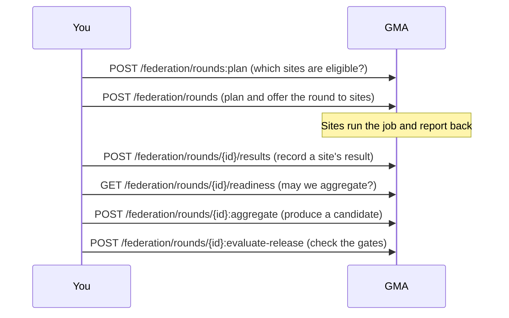

# Step 4: Using the APIs

## Where the APIs are

| Service | Port | Main endpoints |
|---|---|---|
| LMA | 8010 | Governance at one site, dataset profiling, local model runs |
| GMA | 8020 | Governance, federated rounds, site enrolment |
| model-service | 8000 | Model training, checks and jobs |
| pipeline-service | 8030 | Pipeline registry, validation and runs |
| core-service | 8040 | Catalog, topology, workload compilation, Kubernetes manifests |
| Spring control and core | 8050, 8060 | The same control and core APIs for JVM consumers |
| Stroke demo backend | 8080 | The demo's own API, deployed at `https://dagents-healthcare-api.onrender.com` |

The full list of endpoints is generated from the code:
[`docs/reference/service-inventory.md`](../reference/service-inventory.md). The
[framework site](https://pradyunuydarp.github.io/Dagents/#/api) has the same list with a search box.

## Conventions

- Framework services use versioned paths: `/api/v1/...`.
- The agents also keep short paths such as `/health`. Each one calls the same
  handler as its `/api/v1/...` version.
- An action on a resource uses a colon: `rounds:plan`, `rounds/{id}:aggregate`.
- Every Python service serves interactive documentation at `/docs` and its
  OpenAPI schema at `/openapi.json`. Try the deployed one:
  <https://dagents-healthcare-api.onrender.com/docs>.

## Walkthrough 1: the deployed stroke demo API

The deployed API sleeps when nobody has used it for about 15 minutes. The first
request wakes it and takes about 20 seconds.

```bash
API=https://dagents-healthcare-api.onrender.com

# Is it running?
curl -s $API/api/v1/health

# Where does its data come from? Expect "cohort_source": "supabase".
curl -s $API/api/v1/framework/status

# The three hospitals and the release gates
curl -s $API/api/v1/overview

# One hospital's ranked worklist
curl -s "$API/api/v1/hospitals/riverside-general/worklist?limit=3"
```

Each worklist row includes the encounter's fields and an `assessment` with a
score, a priority and the reasons behind them:

```json
{
  "encounter_id": "riverside-general-0135",
  "nihss_total": 32.5,
  "assessment": {
    "score": 0.8818,
    "priority": "urgent",
    "basis": ["NIHSS total recorded as 32.5", "facial droop observed", "..."],
    "warnings": ["blood glucose 2.26 mmol/L is low; hypoglycaemia is a common stroke mimic ..."]
  }
}
```

### Ask the governance planner

`governance:probe` runs one request through the Guard and returns the plan:

```bash
curl -s -X POST $API/api/v1/governance:probe \
  -H "Content-Type: application/json" \
  -d '{"verified": true, "granularity": "row", "cohort_size": 25}'
```

The response includes `permitted`, the `plan` (trust assessment, one strategy per
field, the decision) and the governed `payload`. Change the inputs and compare:

| Body | Result |
|---|---|
| `{"verified": true, "granularity": "row", "cohort_size": 25}` | narrow: `nihss_total` generalized |
| `{"verified": false, "granularity": "row", "cohort_size": 25}` | narrow: `nihss_total` redacted |
| `{"verified": true, "granularity": "table", "cohort_size": 5}` | deny: cohort 5 is below the minimum of 20 |
| `{"verified": true, "granularity": "aggregate", "cohort_size": 25}` | HTTP 422: `aggregate` is not a valid granularity |

### Run a full pilot

```bash
curl -s -X POST $API/api/v1/pilot:run \
  -H "Content-Type: application/json" \
  -d '{"round_prefix": "my-test"}'
```

This runs four federated rounds and then the release gates. In a typical run the
candidate model reaches an AUC of about 0.80, above the 0.78 baseline, and is still
rejected:

| Gate | Result |
|---|---|
| discrimination (AUC ≥ 0.80) | passed |
| improves on current release (AUC ≥ baseline + 0.01) | passed |
| subgroup fairness (AUC gap ≤ 0.05) | **failed**: gap 0.124 |
| sensitivity at alert budget (≥ 0.70) | **failed**: 0.595 |
| alert burden (≤ 400 per 1000, advisory only) | passed |

The decision is `reject`, and the service keeps the current model.

## Walkthrough 2: the framework APIs on your machine

This uses the GMA, the framework's coordinator. Build the planner first (see
[Step 5](05-hands-on.md)), then start the GMA from the repository root:

```bash
export DAGENTSC_BIN=$PWD/bindings/ocaml/_build/default/bin/dagentsc.exe
PYTHONPATH=. .venv/bin/uvicorn agents.gma.main:app --port 8020
```

The example request bodies are in [`docs/learn/examples/`](examples/).

### Plan a governed request

[`restriction-request.json`](examples/restriction-request.json) asks for three
fields of a "patients" classification, at row granularity, from a verified analyst:

```bash
curl -s -X POST http://localhost:8020/api/v1/governance/restrictions:plan \
  -H "Content-Type: application/json" \
  -d @docs/learn/examples/restriction-request.json
```

Result: trust is high, `diagnosis` (high sensitivity) is generalized, and
`age_band` and `region` are returned in full. Edit the file to change the
granularity, remove a verified attribute or lower the cohort size, and run it again.

### Enforce it on data

`restrictions:enforce` takes the request and a payload, applies the plan, and
writes an audit record. [`enforce-request.json`](examples/enforce-request.json)
wraps the same request around two records:

```bash
curl -s -X POST http://localhost:8020/api/v1/governance/restrictions:enforce \
  -H "Content-Type: application/json" \
  -d @docs/learn/examples/enforce-request.json
```

The returned payload:

```json
[
  {"diagnosis": "I63*", "age_band": "70-79", "region": "north"},
  {"diagnosis": "I61*", "age_band": "50-59", "region": "south"}
]
```

The diagnosis codes are generalized (`I63.9` became `I63*`), and `patient_id` is
gone because the request did not ask for it. Then check the audit log:

```bash
curl -s http://localhost:8020/api/v1/governance/audit
```

It lists the decision and reports `"chain_intact": true`.

### Plan a federated round

Enrol three sites, then ask which of them may join a round:

```bash
for site in lakeside-community northgate-university riverside-general; do
  curl -s -X PUT http://localhost:8020/api/v1/federation/sites/$site \
    -H "Content-Type: application/json" \
    -d @docs/learn/examples/site-$site.json
done

curl -s -X POST http://localhost:8020/api/v1/federation/rounds:plan \
  -H "Content-Type: application/json" \
  -d @docs/learn/examples/round-manifest.json
```

Result: all three sites are selected and `quorum_met` is true. The manifest asks
for secure aggregation with a threshold of 3, so three sites are required.

Now make one site ineligible. In `site-lakeside-community.json`, change
`feature_contract_version` to `stroke-triage-features-v1`, enrol it again and plan
again. Lakeside is excluded because its feature contract does not match, only two
sites remain, and the plan stops with `quorum_not_met`.

### The rest of a round



Each path also works under `/api/v1/`. The request schemas are on the GMA's
`/docs` page.

## Read

- [`docs/reference/service-inventory.md`](../reference/service-inventory.md) — every endpoint, generated from the code.
- [FastAPI tutorial](https://fastapi.tiangolo.com/tutorial/) — how the Python services define their endpoints and the `/docs` page.

Next: [Step 5 — Run it yourself](05-hands-on.md)
