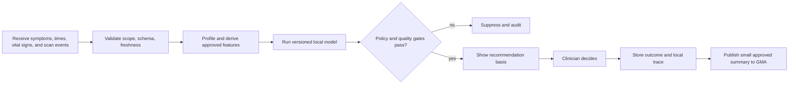
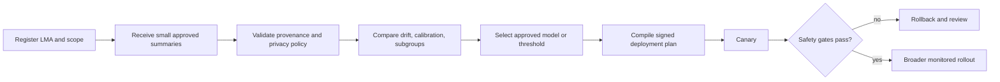
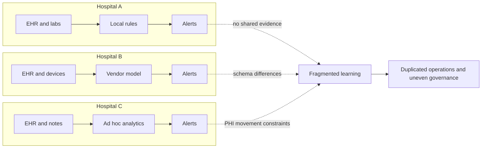
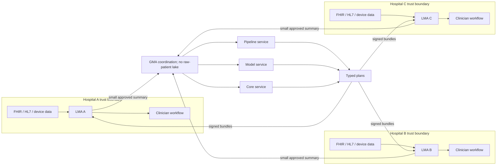
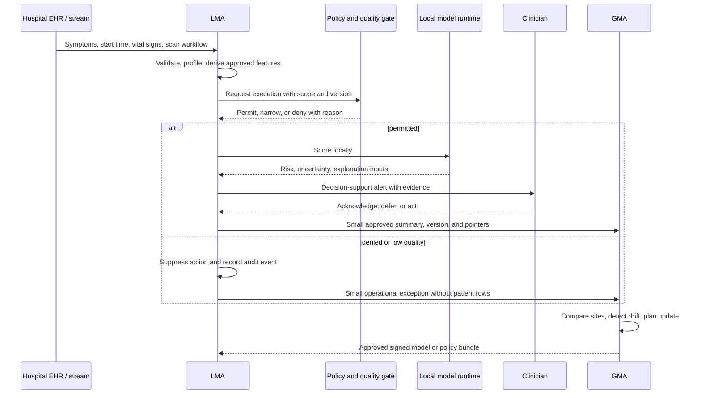
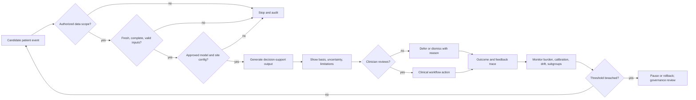

# Dagents healthcare case study: source-first hospital warning support

## Purpose

This document defines a proposed case study for evaluating Dagents in healthcare. It is an engineering and research specification, not a claim that the current repository is clinically validated, HIPAA compliant, SOC 2 audited, or ready to guide patient care.

The case: a hospital consortium wants faster, more consistent review of suspected stroke cases while keeping detailed patient data inside each hospital’s trust boundary. Stroke triage is the first detailed pilot because every minute counts and the required information is scattered across emergency records, symptom notes, arrival times, vital signs, and brain-scan systems. It is not the permanent scope of the platform. Each hospital runs an LMA beside these local sources. The LMA accumulates run history and performs patient-level work locally. The GMA coordinates hospitals using small approved summaries, exceptions, versions, and artifact pointers rather than raw patient rows.

## Why this case is important

CDC reports that more than 795,000 people in the United States have a stroke each year—about one person every 40 seconds—and that roughly 87% are ischemic strokes, where blood flow to the brain is blocked. CDC also stresses that every minute counts and that fast treatment can reduce brain damage. The problem is not simply “build an AI model.” Hospitals must bring symptoms, symptom-start time, transport and arrival details, vital signs, brain scans, and specialist review together quickly without copying all of that sensitive information into a central data lake.

This is an unusually good test for Dagents because the use case needs both local autonomy and multi-site coordination:

- raw protected health information should normally stay under hospital control;
- data schemas, measurement practices, and patient populations vary by site;
- local decisions must remain fast, explainable, and clinician-controlled;
- model versions, thresholds, policies, and rollback decisions need fleet-wide governance;
- deployment and evidence collection must be repeatable across many hospitals.

## Condition portfolio: one platform, separate clinical applications

The project should not use one stroke-triage model as a general medical model. Dagents reuses the **coordination platform**; each condition gets its own approved inputs, model or rules, warning limits, clinician workflow, owner, testing, and safety evidence.

| Condition | Example local information | What the local application supports |
|---|---|---|
| Stroke | symptoms, symptom-start time, vital signs, and the brain-scan workflow | the first detailed pilot: prioritize suspected-stroke scans for faster specialist review |
| Heart attack | symptoms, heart tracing, blood tests, and vital signs | fast local review through a separate heart-specific model and workflow |
| Sudden kidney injury | kidney-related tests, urine output, medicines, and blood pressure trends | notice a quick decline through separate kidney-specific rules or a tested model |
| Serious breathing decline | oxygen level, breathing rate, blood tests, breathing devices, and response to treatment | notice worsening through its own workflow and safety checks |
| Diabetic emergency | blood sugar, ketones, medicines, symptoms, and vital signs | notice dangerous high or low blood sugar through its own tested workflow |

Reusable across all five applications:

- source-local execution and history;
- minimum-data messages to the GMA;
- agent registration, version tracking, deployment plans, safety gates, and rollback;
- repeatable evidence collection for privacy, security, reliability, and review.

Condition-specific work that must not be skipped:

- the exact patient group and intended purpose;
- approved source fields and their meaning;
- a separately tested model or ruleset and warning limit;
- the clinician screen and response workflow;
- clinical ownership, safety review, and measured baseline.

## Why not begin with a central warehouse or data lake?

A warehouse or lake can be useful for some institutional analytics, but it is not the right default dependency for this time-sensitive, privacy-sensitive case.

The traditional warehouse-first path creates several disadvantages:

- **delay:** extract, transfer, clean, and load must complete before central analysis can use new data;
- **large recurring data flow:** detailed hospital records move repeatedly even when coordination needs only small measures and status information;
- **more sensitive copies:** a central raw-data copy adds access, breach, retention, deletion, and incident-response scope;
- **constant integration work:** each source or schema change requires central ingestion and normalization updates;
- **stale feedback:** central measures can trail the local clinical workflow and local model run that produced them;
- **larger failure impact:** a central pipeline or store can affect every participating hospital at once.

The Dagents alternative is **accumulate and compute at the source; exchange only the minimum coordination data**. Detailed patient records, derived patient features, local warnings, clinician responses, outcomes, and most run evidence remain at the hospital. A deployment-specific policy decides which compact fields may cross the boundary.

Example GMA payload:

- hospital/LMA identity and capability;
- run outcome and timestamp window;
- model and configuration version;
- approved counts and data-quality measures;
- approved model-performance and alert-burden summaries;
- operational or policy exceptions;
- artifact or evidence pointers that do not expose patient rows.

## Related domain opportunities

Healthcare candidates:

- stroke, heart-attack, kidney-injury, breathing-decline, and diabetic-emergency warning support;
- readmission and discharge follow-up prioritization;
- chronic-disease remote-monitoring anomaly detection;
- claims waste, abuse, and coding-quality detection;
- imaging workflow quality and model-drift monitoring.

Finance candidates:

- real-time payment fraud detection across issuers or merchants;
- anti-money-laundering typology and network-pattern detection;
- credit-risk and portfolio-drift monitoring;
- liquidity, treasury, and transaction-operations anomaly detection;
- federated model governance across regulated business units or countries.

## Case-study scope and actors

The initial research pilot assumes three hospitals, their emergency and stroke pathways, stroke triage as the first condition, retrospective or silent live execution, and no autonomous clinical action. The model may prioritize a suspected-stroke brain scan for specialist review; it must not diagnose the patient, choose treatment, or remove any case from the normal work queue. A later condition is added only after a separate definition, model, workflow, and safety plan is approved.

Actors:

- hospital clinical leadership: owns intended use, escalation policy, and patient-safety approval;
- data governance and security teams: approve source scope, access, retention, and disclosures;
- EHR/interface team: exposes FHIR, HL7 v2, database, or event-stream adapters;
- LMA operator: owns the local execution boundary and local run evidence;
- GMA operator: owns consortium registration, aggregate analysis, and deployment planning;
- ML team: develops, validates, documents, and monitors candidate models;
- clinicians: independently review each recommendation and retain decision authority;
- compliance/audit teams: inspect technical and organizational control evidence.

## Functional requirements

### 1. Source integration and data quality

- register versioned hospital sources and validate connectivity;
- accept FHIR resources, HL7 v2 feeds, relational extracts, or approved event streams;
- map symptoms, symptom-start time, vital signs, arrival context, brain-scan metadata, review timing, demographics, and outcomes into a canonical feature contract;
- record provenance, event time, units, terminology mappings, and source freshness;
- reject or quarantine invalid, stale, incomplete, or out-of-scope inputs;
- profile distributions and missingness by hospital, ward, and approved cohort.
- keep the detailed profile, source history, and patient-level run evidence at the hospital unless a specific disclosure is approved.

### 2. Local Monitoring Agent functions

- keep identifiable patient-level processing inside the hospital trust boundary;
- construct only approved features for the intended use;
- run a versioned, condition-specific model or deterministic clinical rule locally;
- expose the recommendation basis: contributing inputs, model version, uncertainty, known limitations, and data-quality warnings;
- suppress outputs when policy, quality, or model-approval gates fail;
- send alerts into an approved clinician workflow without automatically diagnosing or treating;
- record acknowledgement, override, deferral, and downstream outcome events;
- accumulate checks, versions, warnings, responses, outcomes, and evidence locally under hospital retention rules;
- publish only the approved minimum operational and performance summaries to the GMA.

### 3. Global Monitoring Agent functions

- register each LMA’s identity, hospital scope, version, and capabilities;
- accept only approved aggregates, profiles, metrics, exceptions, versions, and artifact pointers;
- validate provenance, completeness, configuration, and privacy policy without requiring a central copy of patient rows;
- compare model performance, calibration, drift, alert burden, and subgroup behavior across sites;
- select approved model families, thresholds, or policies by site rather than assuming one universal configuration;
- produce deterministic, reviewable rollout and rollback plans;
- canary new bundles at selected sites before broader deployment;
- retain a consortium-wide lineage from evidence to plan to deployed version.

### 4. Shared services

- pipeline-service: register, validate, and execute repeatable profiling, feature, scoring, and evaluation workflows;
- model-service: provide pluggable training/inference jobs, model checks, artifacts, and evaluation metadata; the current repository’s anomaly models are infrastructure examples, not a stroke-triage model;
- core-service: compile versioned Kubernetes workloads, services, service accounts, and configuration resources;
- typed planner layer: validate pipeline, model-routing, schema, policy, and manifest plans before side effects;
- control contracts: register agents, trigger runs, synchronize bundles, publish telemetry, and compile workloads through shared types.

## Functional diagrams

### Current fragmented workflow

### Dagents target architecture

### End-to-end event sequence

### Clinical safety and rollback gates

## Compliance and assurance model

Dagents can provide reusable technical control points and evidence. It cannot make an organization compliant by itself.

| Framework or concern | Dagents-aligned mechanism | Production controls still required |
|---|---|---|
| HIPAA Security Rule | local trust boundaries; scoped sources; run IDs; versioned plans; workload generation | identity and role-based access, MFA, encryption in transit/at rest, key management, audit controls, integrity checks, backups, risk analysis, incident response, BAAs |
| HIPAA Privacy Rule | approved feature contracts; source-local accumulation and processing; minimum-data GMA interface; policy gates | purpose/use policies, minimum-necessary decisions where applicable, authorization/consent processes, disclosures accounting, retention and deletion, privacy notices, workforce training |
| SOC 2 Trust Services Criteria | deterministic plans, service health, run evidence, artifact lineage, deployment repeatability | formal control ownership, change management, access reviews, availability targets, vendor risk, incident evidence, operating-effectiveness period, independent CPA examination |
| Clinical decision support / FDA analysis | clinician-in-the-loop design; visible model/input basis; validation metadata; version trace | intended-use determination, regulatory assessment, clinical validation, human-factors work, labeling, post-market monitoring, quality system where applicable |
| Interoperability | source adapters and canonical DatasetInput/SourceSpec boundaries | FHIR/US Core profiles, terminology services, USCDI mapping, conformance testing, provenance and patient matching |
| Responsible AI | local and cross-site drift/subgroup monitoring; policy gates; rollback plan | governance board, risk acceptance, bias evaluation, model cards, clinical-safety case, continuous review under NIST AI RMF or equivalent |

Important distinction: SOC 2 is an attestation report on the design and, for Type II, operating effectiveness of organizational controls. It is not a feature flag. HIPAA compliance also includes administrative and physical safeguards outside the codebase.

## What Dagents already contributes and what must be built

Implemented or substantially present in the repository:

- LMA source profiling and source-level model execution;
- GMA registration, assimilated profiling, aggregate model execution, and deployment planning;
- shared source, model, dataset-profile, and workload contracts;
- pipeline registration, validation, execution, and run inspection;
- model-service training infrastructure and artifact persistence patterns;
- core-service workload and Kubernetes manifest generation;
- typed OCaml planning direction and process-boundary integration;
- Docker images and Compose-based multi-service deployment.

Required for this healthcare case study:

- production FHIR/HL7 and terminology adapters;
- a clinically appropriate stroke-triage model or ruleset for the first pilot, with external and site-specific validation;
- a separate input contract, model or ruleset, warning limit, workflow, and validation package for every later condition;
- event-time processing and low-latency local inference;
- clinician workflow integration, explanation display, and feedback capture;
- durable repositories, broker-backed messaging, idempotency, retries, and replay;
- strong identity, authorization, secrets, encryption, network segmentation, and tenant isolation;
- immutable audit evidence, retention/deletion rules, and security monitoring;
- signed bundle verification, canary deployment, rollback, and configuration attestations;
- privacy-preserving aggregation and formal disclosure policies;
- an explicit minimal-message contract that prevents raw patient rows from entering the GMA path;
- clinical-safety governance, regulatory analysis, and a quality-management process.

## Effort argument

Dagents does not remove the work of clinical validation, integration, or compliance. It concentrates reusable engineering effort in one framework:

- without Dagents, every hospital integration tends to rebuild source validation, run orchestration, model routing, version tracking, deployment generation, and evidence collection;
- with Dagents, teams can reuse those boundaries while spending project-specific effort on clinical semantics, validation, workflow design, and governance;
- after the stroke pilot, the local/global controls, deployment patterns, version records, and rollback process can be reused, but the clinical application itself must still be built and tested separately;
- the additional framework effort is justified when there are multiple hospitals, multiple models, repeated deployments, or more than one regulated consumer;
- for a single static model at one site, Dagents may be more infrastructure than necessary.

## Pilot plan

1. Contract and safety definition: specify intended use, cohort, FHIR/HL7 mappings, outcome label, exclusions, and governance ownership.
2. Retrospective local validation: run each LMA on historical site data; compare data quality, calibration, subgroup performance, and missingness.
3. Shadow-mode deployment: generate recommendations without presenting them to clinicians; validate latency, reliability, alert volume, and trace completeness.
4. Clinician-reviewed pilot: show recommendations with their basis; measure workflow fit, override reasons, and alert burden under an approved protocol.
5. Consortium evaluation: let the GMA compare de-identified site metrics, detect drift, and propose threshold or bundle changes.
6. Production assurance: complete security risk analysis, control testing, regulatory assessment, disaster recovery, incident response, and independent clinical validation.
7. Condition-by-condition expansion: choose one additional condition, then repeat the definition, past-data test, silent live test, clinical review, and safety approval with a separate baseline.

## Evaluation measures

No outcome targets should be invented before baseline data is measured. Each condition needs its own baseline and evaluation. The research evaluation should report:

- clinical discrimination and calibration by site and clinically relevant subgroup;
- sensitivity and positive predictive value at a fixed, clinician-approved alert budget;
- lead time relative to the chosen reference event;
- alert rate, duplicate rate, acknowledgement time, and override reasons;
- data freshness, missingness, pipeline success, inference latency, and recovery time;
- model/version coverage, audit-trace completeness, rollback time, and unauthorized-access attempts;
- site-to-site variability and whether GMA-planned configurations improve consistency without masking local differences.

## Glossary

| Term | Plain meaning | Meaning in this case study |
|---|---|---|
| Stroke | An emergency where blood flow in the brain is blocked or a blood vessel breaks | The first proving case; Dagents helps prioritize suspected-stroke scans for faster specialist review |
| Heart attack | Blood flow bringing oxygen to part of the heart suddenly becomes blocked | Needs fast review and a separate heart-specific model and workflow |
| Sudden kidney injury | Kidney function falls quickly over hours or days | Needs local trend monitoring and separate kidney-specific rules and testing |
| Serious breathing decline | The lungs cannot provide enough oxygen or remove enough carbon dioxide | Needs oxygen and breathing monitoring with its own workflow and safety review |
| Diabetic emergency | Blood sugar becomes dangerously high or low | Needs its own inputs, limits, and clinician response plan |
| Stroke triage | Sorting suspected-stroke cases so the most urgent scan can be reviewed quickly | Decision support only; it does not diagnose stroke or choose treatment |
| Ischemic stroke | A stroke caused by blocked blood flow to the brain | The most common stroke type; a brain scan helps clinicians determine the stroke type |
| EHR | A hospital's digital patient record | A local source of vital signs, laboratory results, medicines, and visit information |
| PHI | Health information that can identify a person | Remains at the hospital source unless an approved use explicitly allows disclosure |
| Clinical decision support | Software advice shown to a clinician | The clinician, not Dagents or the model, makes the care decision |
| LMA | Local Monitoring Agent | Runs beside one hospital's sources and keeps patient-level computation and history local |
| GMA | Global Monitoring Agent | Coordinates hospitals through small approved summaries, plans, versions, and pointers |
| Data warehouse / lake | A central store that copies data from many systems | Useful for some analytics, but not required for the source-first warning architecture |
| Past-data test | Running on historical records | A safer first validation step before live use |
| Silent live test | Running on current data without showing clinicians a warning | Tests speed and reliability without changing care |
| Small rollout / rollback | Try an update at a few sites / return to the earlier safe version | Limits harm when a new model or setting behaves badly |
| HIPAA | U.S. rules for protecting patient health information | Guides privacy and security controls; architecture alone is not compliance |
| SOC 2 | An independent review of service security and reliability controls | Requires operating controls and evidence, not only design documents |

## Sources

- Dagents repository architecture: `docs/agents/lma-gma-architecture.md`, service READMEs, and `contracts/grpc/dagents/agents/v1/lma_gma.proto`.
- CDC, “Stroke Facts”: https://www.cdc.gov/stroke/data-research/facts-stats/
- CDC, “Signs and Symptoms of Stroke”: https://www.cdc.gov/stroke/signs-symptoms/index.html
- CDC, “Treatment and Intervention for Stroke”: https://www.cdc.gov/stroke/treatment/index.html
- FDA, “FDA Permits Marketing of Clinical Decision Support Software for Potential Stroke”: https://www.fda.gov/news-events/press-announcements/fda-permits-marketing-clinical-decision-support-software-alerting-providers-potential-stroke
- FDA 510(k) K211179, stroke workflow triage software: https://www.accessdata.fda.gov/cdrh_docs/pdf21/K211179.pdf
- NIH/NHLBI, “Heart Attack”: https://www.nhlbi.nih.gov/health/heart-attack
- NIH/NIDDK, “Acute Kidney Injury”: https://www.niddk.nih.gov/research-funding/research-programs/acute-kidney-injury
- NIH/NHLBI, “Respiratory Failure”: https://www.nhlbi.nih.gov/health/respiratory-failure
- HHS, HIPAA Security Rule and technical safeguard summary: https://www.hhs.gov/hipaa/for-professionals/security/index.html and https://www.hhs.gov/hipaa/for-professionals/security/laws-regulations/index.html
- HHS, HIPAA Minimum Necessary Requirement: https://www.hhs.gov/hipaa/for-professionals/privacy/guidance/minimum-necessary-requirement/index.html
- AICPA, 2017 Trust Services Criteria with revised points of focus—2022: https://www.aicpa-cima.com/resources/download/2017-trust-services-criteria-with-revised-points-of-focus-2022
- FDA, Clinical Decision Support Software, Final Guidance, January 2026: https://www.fda.gov/regulatory-information/search-fda-guidance-documents/clinical-decision-support-software
- HL7 FHIR R4 Observation: https://hl7.org/fhir/R4/observation.html
- ONC, Standards & Technology / USCDI: https://healthit.gov/standards-and-technology/
- NIST AI Risk Management Framework: https://airc.nist.gov/airmf-resources/airmf/
