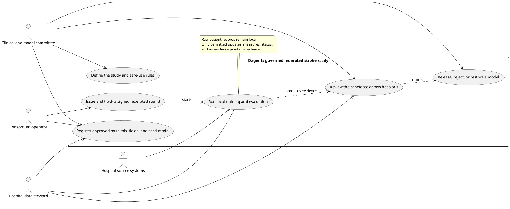
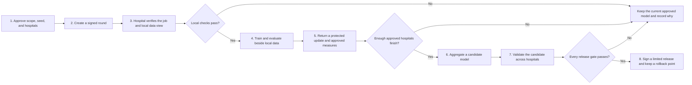
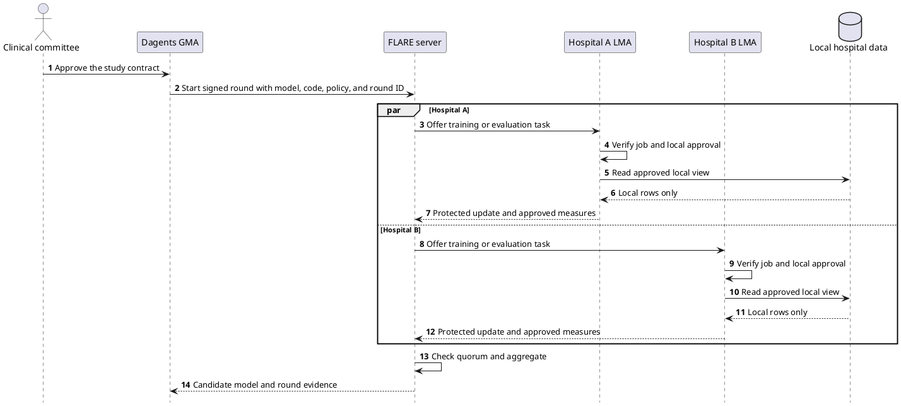
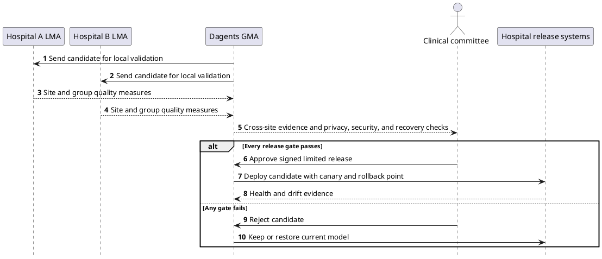
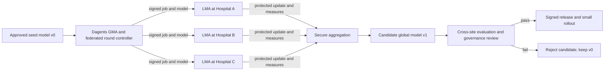
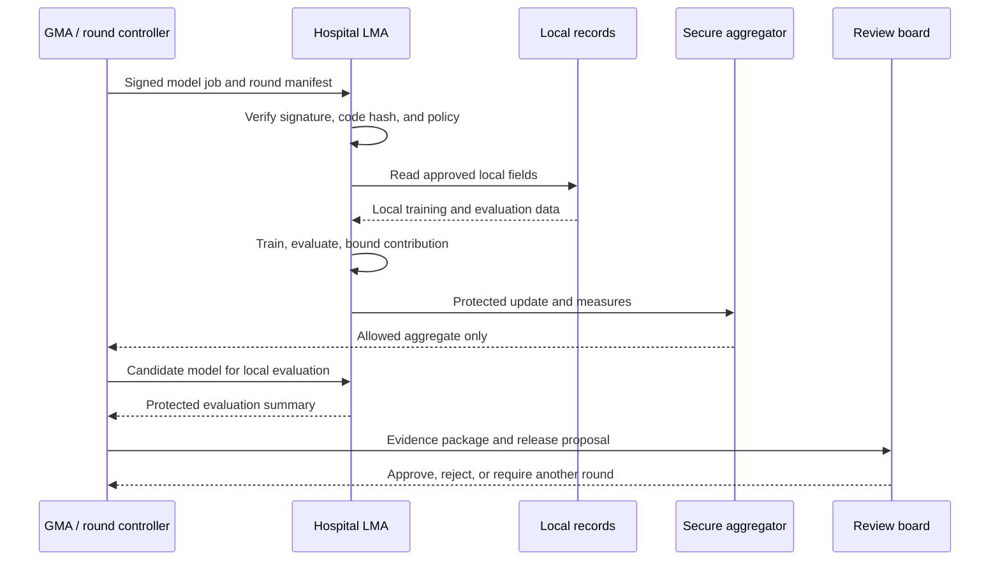
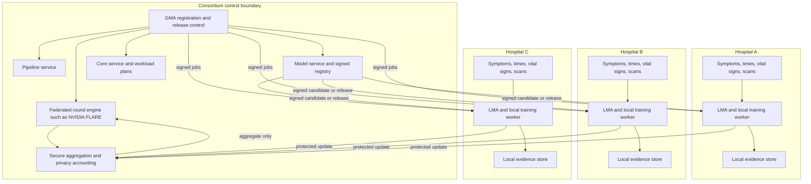
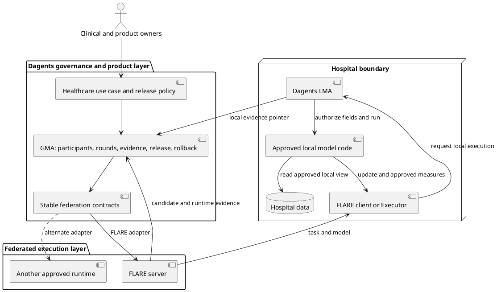

# Dagents use case: federated stroke-triage improvement across hospitals

## Status and purpose

This is a proposed engineering and research use case. It is not a claim that Dagents currently implements federated learning, is clinically validated, is HIPAA compliant, has a SOC 2 report, or is ready to influence patient care.

The proposal is to use Dagents as the control plane for a **cross-silo federated learning** pilot. A group of hospitals improves and evaluates one stroke-triage model without building a central store of patient records or brain scans.

The first pilot is specific to suspected-stroke triage: help prioritize brain scans for faster specialist review. The platform pattern may later be reused for heart attack, sudden kidney injury, serious breathing decline, or diabetic emergencies, but every condition needs a separate clinical definition, model, workflow, and safety case.

## Start here: the functional story

The system has three jobs. Hospitals keep control of their patient data and approve local work. Dagents defines and records the study, the participating sites, the evidence, and the release decision. NVIDIA FLARE, or another approved federated runtime, performs the distributed training and evaluation protocol.

The key rule is simple: aggregation creates a candidate model. It does not create an approved clinical release. A candidate is released only after local validation, cross-hospital review, and human approval.

### Use case diagram



### End-to-end functional flow



### Sequence 1: create a candidate



### Sequence 2: approve or reject the release



## The concrete use case

A consortium of five hospitals wants to improve a model that prioritizes suspected-stroke brain scans for faster specialist review in emergency and stroke pathways. It is workflow support—not a diagnosis or treatment system.

Pilot assumptions:

- five hospitals participate as separate trust boundaries;
- detailed patient records remain under each hospital's control;
- the first version is tested on past data, then in a silent live run;
- no automatic diagnosis, treatment, queue removal, or clinician-facing warning is allowed in the first two stages;
- a central seed model is created from public, properly de-identified, consented, synthetic, or otherwise approved data—not by copying private hospital records into Dagents;
- the central coordinator sends a signed model job to every approved hospital;
- each hospital trains or evaluates the model locally;
- hospitals return protected model updates and approved measures, not patient rows;
- a new global model is released only after technical, privacy, fairness, and clinical review.

## Why this is a good Dagents use case

The difficult problem is broader than model training:

- every hospital has different record systems, units, coding practices, and patient populations;
- a multi-hospital model needs repeatable rounds, participant tracking, version history, and evidence;
- model updates may leak information and therefore need protection and review;
- hospitals need local control over code, data access, retention, and participation;
- a bad global model must be stopped and replaced with a known-good version quickly;
- the same control plane should later support federated analytics, cross-site evaluation, and additional clinical applications.

Dagents already has a useful structural match:

- an LMA is the local execution boundary near one hospital's sources;
- a GMA is the global coordination boundary;
- pipeline-service can represent repeatable profiling, training, evaluation, and packaging steps;
- model-service provides generic model-job and artifact patterns;
- core-service can generate versioned workloads;
- shared contracts already cover sources, profiles, model execution, deployment plans, and workloads.

The current repository does **not** yet provide secure aggregation, a federated optimizer, differential privacy, production messaging and storage, signed model supply-chain enforcement, or clinical validation.

## What federated AI means here

Federated learning trains a shared model while the training data remains at the participating hospitals. The coordinator sends the current model and approved training instructions. Each hospital computes an update using local data. The coordinator combines updates into a new global model.



The term **federated AI** is broader than federated learning. In this use case it includes:

- federated analytics for shared counts, data-quality measures, and evaluation;
- federated training for protected model updates;
- local inference at each hospital;
- central policy, version, deployment, and evidence coordination.

## One complete federated round

1. **Select participants.** The GMA checks which hospitals, LMAs, data contracts, and model versions are approved for this round.
2. **Create a signed job.** The job contains the model artifact, training or evaluation code hash, allowed source contract, privacy settings, round identifier, and stop conditions.
3. **Approve locally.** Each hospital verifies the signature and either accepts or rejects the code and requested data access.
4. **Prepare locally.** The LMA validates units, missing data, patient group, time window, and label availability.
5. **Train or evaluate locally.** Raw records and patient-level features remain within the hospital.
6. **Protect the output.** The LMA clips or bounds its contribution, applies the approved privacy mechanism, and participates in secure aggregation when configured.
7. **Aggregate.** The federated engine produces only the allowed combined update and combined measures after the minimum participation threshold is met.
8. **Evaluate.** The candidate model is tested at each hospital and compared with the current approved model.
9. **Release or reject.** A signed release is created only if the technical, privacy, subgroup, and clinical review gates pass.
10. **Retain evidence.** Each hospital keeps its detailed local trace; the GMA keeps the round manifest, participants, aggregate results, approvals, and release lineage.



## Bootstrap and update strategy

### Central bootstrap

The central team creates model version `v0` with an approved feature contract and intended use. The seed may be randomly initialized, pretrained on public or approved data, or adapted from an existing validated research model. The source of the seed must be recorded.

The bootstrap package contains:

- model artifact and model-card draft;
- data and feature contract;
- local preprocessing and training code;
- evaluation code and required measures;
- privacy and aggregation settings;
- site eligibility rules;
- digital signature and dependency manifest;
- safe fallback version.

### Iterative updates

Hospitals do not send records to the coordinator. They send the exact update type allowed by the round, such as clipped weight differences, gradients, or evaluation aggregates. The federated engine combines updates, creates a candidate, and repeats until the agreed stopping rule is met.

The final model is not automatically deployed. It passes cross-site evaluation, clinical review, change approval, canary deployment, and rollback readiness first.

## The four industry methods and their boundaries

| Method | What moves | Main job | Role in this use case | Important limit |
|---|---|---|---|---|
| Federated learning | protected model updates and combined measures | train or fine-tune a shared model | improve the stroke-triage model across hospitals | model updates can still leak information without protection |
| Federated analytics | approved local counts, statistics, and evaluation measures | understand distributed data without collecting it | data readiness, missingness, label counts, model evaluation, drift | an aggregate can still be sensitive if groups are too small |
| Federated database | remote queries and returned rows or results | give one query layer over several sources | useful within a hospital to join EHR, lab, and device sources; limited cross-hospital aggregate queries | it can expose or move detailed data; it is not automatically privacy preserving |
| Enterprise backup patterns | baseline copies, incremental changes, metadata, health results | protect versions and recover known-good state | model catalog, signed releases, integrity checks, and rollback | backup software does not perform federated learning or clinical validation |

### Recommended order

Start with federated analytics before federated training:

1. confirm every hospital can produce the same approved measures;
2. measure missing data, cohort size, label availability, and site differences;
3. evaluate the seed model locally;
4. prove the minimum-message path and evidence trail;
5. enable federated training only after the data and control contracts are stable.

## Why Dagents instead of a framework or SaaS alone

Dagents is most credible as the layer that connects hospital-local execution, specialist federation, evidence, and recoverable releases. It should complement a federated-learning engine, not pretend that the engine is unnecessary.

| Choice | Advantages | Tradeoffs |
|---|---|---|
| **Dagents plus a specialist FL engine** | reusable LMA/GMA boundary; hospital-local execution; one place for round policy, evidence, deployment, and rollback; portable across consumers | more integration and operational ownership; production privacy, identity, and clinical controls still need to be built |
| **Federated-learning framework alone** | mature distributed-training algorithms, simulation, aggregation, and privacy extensions | does not automatically provide Dagents' reusable service catalog, pipeline orchestration, Kubernetes workload planning, evidence model, or release lifecycle |
| **Managed federated-learning SaaS** | faster onboarding, hosted control plane, vendor support | vendor lock-in, recurring cost, deployment and data-boundary constraints, and less control over evidence and recovery design |
| **Central warehouse plus ML platform** | mature central analytics and model tooling | large data movement, delayed copies, duplicated sensitive records, and a heavier governance boundary |
| **One-off custom hospital integration** | can match one consortium exactly | slow to reproduce, expensive to maintain, and likely to create incompatible contracts for the next condition or product |

The strongest argument for Dagents is therefore **control, portability, and recoverability around specialist learning**. The main cost is that the consortium owns more engineering and assurance work than it would with a fully managed product.

## NVIDIA FLARE and the EXAM study

NVIDIA FLARE is a federated-learning runtime that supports client/server workflows and allows model updates to be aggregated while private source data remains at client sites.

**EXAM** means **Electronic Medical Record Chest X-ray AI Model**. It was a COVID-19 research study, not a stroke study. The model estimated whether a symptomatic patient would need oxygen support 24 or 72 hours after arriving at an emergency department. Each site used the patient's first chest X-ray plus 19 approved electronic-record features, including vital signs, laboratory values, and age.

The EXAM study, published in *Nature Medicine*, is a useful healthcare example:

- 20 institutions participated;
- the cohort contained 16,148 cases;
- the model combined the first emergency-department chest X-ray with 19 approved electronic-record features;
- sites collaborated without exchanging their raw datasets;
- the reported global model achieved average AUC above 0.92 for the studied prediction tasks;
- the paper reported a 16% average AUC improvement and a 38% average generalizability improvement compared with locally trained models for the 24-hour task;
- the paper also stated that the model was for research and was not approved by a regulatory agency.

AUC is a common measure of how well a model separates higher-risk from lower-risk cases. A value of 1.0 is perfect separation and 0.5 is close to chance. The EXAM result is evidence that cross-hospital federation can work as an operating model. It is not evidence that Dagents or a stroke model will achieve the same performance.

What Dagents should learn from this example:

- federated learning is a real cross-hospital operating model, not just a diagram;
- site data remains heterogeneous even when the feature list is shared;
- the control plane must run many traceable experiments, not one model push;
- each site needs local training and evaluation capability;
- cross-site performance must be measured before a release;
- model distribution, code approval, privacy controls, and operations matter as much as the aggregation algorithm.

Dagents should integrate with a specialist runtime such as NVIDIA FLARE rather than reimplement every federated optimizer and privacy mechanism inside the GMA.

## What federated databases contribute

A federated database presents remote sources through a common query layer and can push parts of a query to the source. This can help an LMA create a local feature view across the hospital's EHR, laboratory database, device store, and approved research system without first building a second hospital-wide lake.

Safe uses in this proposal:

- local joins inside one hospital trust boundary;
- source-side filters and aggregates;
- read-only feature views with least-privilege access;
- approved cross-hospital queries that return only sufficiently large aggregates.

Unsafe default:

- letting the GMA issue unrestricted patient-level queries across hospitals.

Federated databases solve query access. Federated learning solves distributed model training. They can be used together, but they are not interchangeable.

## What enterprise backup software contributes

Enterprise backup systems commonly separate central administration from workers near data sources. They keep a catalog of protected items and restore points, start with a full baseline, record smaller incremental changes, verify integrity, protect recovery copies, and test restoration.

Dagents can borrow these patterns:

| Backup idea | Federated-model equivalent |
|---|---|
| Protection policy | approved model, site, purpose, cadence, retention, and privacy policy |
| Full backup / golden image | signed seed model, code package, dependencies, and feature contract |
| Incremental backup | bounded model update plus round metadata |
| Backup catalog | model registry and complete round lineage |
| Health check and checksums | artifact hash, signature verification, schema test, and reproducible evaluation |
| Immutable restore point | approved model release that cannot be silently changed |
| Restore drill | tested rollback to the last known-good model and configuration |
| Offline or separate copy | separately protected recovery package and audit evidence |

The analogy has a limit: a backup chain recreates an earlier state, while federated aggregation creates a new learned state. An incremental model update cannot be trusted simply because it is small.

## Proposed Dagents architecture



## Functional requirements

### GMA and round controller

- register hospital identity, LMA capability, approved condition, schema version, and eligibility;
- create deterministic round manifests and unique round identifiers;
- select only approved sites and require a minimum participant threshold;
- distribute signed model jobs and verify acknowledgements;
- coordinate timeouts, retries, dropouts, and round cancellation;
- call the specialist federated engine for aggregation;
- prevent release when privacy, technical, site, or clinical gates fail;
- retain aggregate lineage from seed model to round to candidate to release;
- produce a signed rollout and rollback plan.

### LMA and hospital worker

- verify job signature, code hash, dependency list, requested fields, and approved purpose;
- allow the hospital to reject a job before code touches local data;
- construct the approved feature view from local systems;
- check units, timestamps, missingness, patient group, and label availability;
- train and evaluate locally in an isolated workload;
- bound the site's contribution and apply configured privacy controls;
- publish only the allowed protected update and measures;
- keep patient-level trace, local metrics, and approvals under hospital retention rules;
- evaluate candidate and released models locally;
- return to the last approved model when a stop condition is met.

### Shared services

- model registry with signed, immutable release identifiers;
- secure aggregation and optional differential-privacy accounting;
- durable queues, idempotency, replay protection, and recovery;
- policy engine for source scope, site eligibility, minimum cohorts, and egress;
- secrets, key rotation, mutual authentication, and certificate lifecycle;
- tamper-evident audit records and local evidence pointers;
- healthcare source adapters and terminology/version handling;
- monitoring for round completion, site dropouts, update anomalies, and release health.

## Minimum message contracts

### Federated job

```json
{
  "round_id": "round-0042",
  "condition": "suspected_stroke",
  "intended_use_id": "approved-research-use",
  "model_version": "seed-v3",
  "model_artifact_digest": "sha256:...",
  "training_code_digest": "sha256:...",
  "feature_contract_version": "stroke-triage-features-v2",
  "site_policy_version": "hospital-policy-v7",
  "aggregation_method": "approved-fedavg-profile",
  "privacy_profile": "consortium-profile-v1",
  "minimum_participants": 3,
  "stop_conditions": ["schema_failure", "privacy_budget_exceeded", "unsafe_metric"]
}
```

### Hospital result

```json
{
  "round_id": "round-0042",
  "site_id": "hospital-a",
  "job_digest": "sha256:...",
  "status": "accepted-and-completed",
  "protected_update_pointer": "secure-aggregation-session:...",
  "approved_metric_bundle": "aggregate-only",
  "local_evidence_pointer": "hospital-local://...",
  "input_contract_version": "stroke-triage-features-v2",
  "code_verified": true,
  "privacy_checks_passed": true
}
```

No patient identifier, row, image, note, or patient-level prediction belongs in the GMA result contract.

## Security, privacy, and clinical controls

Federated learning reduces raw-data movement, but it is not automatically private or compliant.

Required controls include:

- hospital-approved purpose and source scope;
- minimum cohort and participant thresholds;
- encrypted transport and mutual authentication;
- model/job signatures and code approval at the hospital;
- secure aggregation where the coordinator should not read an individual site's update;
- contribution clipping, update validation, and differential privacy when justified;
- defenses against malicious or poisoned updates;
- access control, key management, retention, deletion, incident response, and audit;
- separate clinical validation, usability review, intended-use decision, and regulatory analysis;
- no automatic diagnosis, treatment, queue removal, or care action in the research pilot.

Important limits:

- model weights or gradients can leak information;
- secure aggregation hides individual updates from the coordinator but does not by itself stop a malicious participant or prevent the final model from memorizing information;
- differential privacy adds a measurable privacy bound but can reduce model usefulness;
- a small number of hospitals makes privacy thresholds and collusion analysis especially important;
- local data differences can make one global model worse for one hospital or patient group;
- a successful retrospective result is not evidence of safe clinical deployment.

## Failure modes and required responses

| Failure | Detection | Safe response |
|---|---|---|
| Site sends the wrong schema or units | local contract check and aggregate anomaly check | reject site contribution; do not release candidate |
| Too few sites complete a round | minimum-participant gate | cancel round; reveal no individual update |
| Update is unusually large or suspicious | clipping and update anomaly policy | quarantine contribution; security review |
| Training code is unapproved | local signature and code-hash check | hospital rejects job before execution |
| Candidate improves globally but harms one site or group | federated evaluation by site and approved subgroup | keep current release; revise model or site policy |
| Global model performs worse after rollout | silent/canary monitoring | pause rollout and restore last known-good release |
| GMA or messaging is unavailable | heartbeats, durable queue, idempotent round state | keep local approved model running; resume or cancel safely |
| Audit or model artifact is altered | digest, signature, and immutable release catalog | block deployment; investigate and restore evidence |

## Pilot plan

1. **Define the clinical research question.** Approve the suspected-stroke patient group, scan type, outcome, exclusions, site owners, and stop conditions.
2. **Run federated analytics only.** Compare counts, missingness, units, label availability, and seed-model evaluation without training.
3. **Simulate federated training.** Use non-sensitive or approved test data to exercise the complete round, dropout, retry, and rollback paths.
4. **Retrospective cross-silo training.** Train on historical hospital data and evaluate the candidate locally at every site.
5. **Silent live evaluation.** Run the approved model on current data without showing warnings to clinicians.
6. **Limited clinician-facing study.** Proceed only under a separate clinical protocol, safety review, and regulatory assessment.

Every phase needs evidence to advance; a calendar date is not enough.

## Success measures

### Model evidence

- discrimination and calibration at every hospital;
- performance by approved patient group;
- comparison with local-only and current approved baselines;
- alert volume and stability when run silently;
- effect of site dropouts and heterogeneous data.

### Privacy and data movement

- zero raw patient rows in the GMA path;
- size and type of every outbound message;
- secure-aggregation threshold compliance;
- privacy-accounting results where differential privacy is used;
- blocked unapproved fields, code, and small-cohort results.

### Operations and recovery

- round completion and retry rates;
- artifact and code-signature verification rate;
- time to stop a bad round;
- time to restore the last approved model;
- successful scheduled rollback drills;
- complete lineage from job to site results to global release.

## Recommendation

Use Dagents as the **governed orchestration and release layer**, not as a replacement for NVIDIA FLARE or another specialist federated-learning engine.

Start with federated analytics and cross-site evaluation. Add federated training only after the common data contract, minimum-message contract, local approval path, secure aggregation, release catalog, and rollback drill are proven.

## Plain-language glossary

| Term | Plain meaning |
|---|---|
| Federated learning | Hospitals improve one shared model by training locally and sending protected updates instead of patient records |
| Federated analytics | Hospitals calculate approved measures locally and reveal only combined results |
| Federated database | One query layer that can read from several remote data sources |
| Seed model | The approved starting model sent to participating hospitals |
| Model update | A mathematical change produced by local training; it is not automatically anonymous |
| Secure aggregation | A method that lets the coordinator learn a combined update without reading each site's update |
| Differential privacy | A mathematical privacy method that limits how much one participant can affect a released result |
| Cross-silo | A small number of organizations, such as hospitals, collaborating while remaining separate |
| LMA | The Dagents local agent running inside one hospital boundary |
| GMA | The Dagents global agent coordinating sites, rounds, versions, and releases |
| Rollback | Returning to the last known-good model and configuration |
| Restore point | Backup-language analogy for an immutable approved model release |
| Stroke | An emergency where blood flow in the brain is blocked or a blood vessel breaks |
| Stroke triage | Sorting suspected-stroke cases so an urgent brain scan can reach a specialist quickly; it does not diagnose or choose treatment |
| Brain scan | A picture of the brain, commonly CT or MRI, used by clinicians to understand the type and location of a possible stroke |

## Appendix: federated AI and NVIDIA FLARE in plain language

This appendix is a self-contained orientation for readers who have not used a federated-learning framework. The terms describe different layers of a system; they should not be treated as synonyms.

### Federated AI is an umbrella term

**Federated AI** means AI or analytics work that is coordinated across separate data owners while each owner keeps control of its local data and computing environment. It can include several different methods:

| Term | Plain meaning | What normally crosses the boundary |
|---|---|---|
| Federated learning | Several sites improve one shared model by training locally | model updates and approved evaluation measures |
| Federated analytics | Several sites calculate approved measures locally | counts, statistics, data-quality measures, or evaluation summaries |
| Federated database | One query layer reaches several remote data sources | queries and results, which may still contain detailed rows unless restricted |
| Secure aggregation | The coordinator learns a combined update without reading each site's individual update | masked or encrypted contributions that reveal only an allowed aggregate |
| Differential privacy | Noise and contribution limits reduce how much one record or participant can affect a released result | a deliberately less precise result with a measured privacy bound |

Federated learning does not automatically mean private, secure, fair, accurate, compliant, or clinically useful. Those properties need separate controls and evidence.

### What NVIDIA FLARE is

NVIDIA FLARE stands for **NVIDIA Federated Learning Application Runtime Environment**. It is an open-source Python software development kit for coordinating distributed or federated computing jobs.

It provides the specialist runtime that can:

- define a federated job, participants, rounds, and an aggregation method;
- run a server-side workflow that assigns work to approved clients;
- run client-side code near each hospital's data;
- exchange models, tasks, updates, and evaluation results;
- support algorithms such as FedAvg, FedProx, FedOpt, and other workflows;
- support simulation, local proof-of-concept testing, and distributed production deployment;
- provide security and privacy building blocks such as provisioning, mutual TLS, site authorization, audit logging, privacy filters, and optional encryption approaches.

It does **not** provide the stroke model, define safe clinical use, make a hospital HIPAA compliant, replace local identity and security operations, or decide whether a candidate model should be released into care.

### Four NVIDIA FLARE names worth knowing

| FLARE term | Plain meaning | Simple example in this case |
|---|---|---|
| Job or Job Recipe | The packaged definition of what should run | the stroke model, client code, number of rounds, sites, aggregation method, and validation plan |
| Controller | The server-side workflow coordinator | selects clients, creates tasks, tracks round progress, and processes returned results |
| Task | One unit of work sent to a client | train the current model locally or evaluate one candidate model |
| Executor or Client API | The client-side connection between FLARE and local code | receives the task, calls the hospital's training or evaluation code, and returns an allowed result |

At lower levels, FLARE may represent exchanged information as an `FLModel` or a `Shareable`. A new user does not need to memorize those classes. The important idea is that the payload contains a model or task information and approved metadata—not the hospital's patient database.

### One federated round

One round is one complete request-and-return cycle:

1. The coordinator selects eligible hospitals and the current approved model.
2. The controller creates a task and makes it available to the selected clients.
3. Each client receives the task and runs local training or evaluation through its executor or client code.
4. Each hospital returns only the permitted update and measures.
5. The aggregation method combines the permitted contributions into a candidate model.
6. The candidate is evaluated at participating sites.
7. Governance decides whether to run another round, reject the candidate, or prepare a controlled release.

A round is not a database synchronization. It should have a round ID, participant list, input model version, code version, privacy settings, result status, and stop reason.

### FedAvg: the simplest aggregation mental model

**Federated Averaging**, usually called **FedAvg**, is a common starting algorithm:

1. every participating site starts from the same global model;
2. each site trains that model using its approved local data;
3. each site sends a model change instead of its data rows;
4. the server averages the model changes, commonly weighting them by the amount of approved local training data;
5. the combined result becomes a candidate global model for evaluation.

For a simplified example, if Hospital A trained on 100 approved examples and Hospital B trained on 300, Hospital B's update may receive three times the weight. Real deployments may use different algorithms, caps, quality rules, fairness policies, or site-specific models. FedAvg is a useful mental model, not an automatic choice for every healthcare problem.

### Privacy and security layers solve different risks

| Layer | What it protects | Important limitation |
|---|---|---|
| Secure aggregation | prevents the coordinator from reading an individual site's update when the required participation threshold is met | does not stop a malicious participant, model poisoning, or memorization in the final model |
| Differential privacy | limits how strongly one record or participant can affect a released result by clipping contributions and adding calibrated noise | stronger privacy can reduce model usefulness; the privacy budget must be tracked across rounds |
| TLS or mutual TLS | encrypts network traffic and authenticates communicating parties | does not make a received model update harmless or anonymous |
| Digital signature and digest | proves which code or model package was approved and whether it changed | does not prove that the model is clinically safe or accurate |
| Local authorization | lets each hospital accept or reject users, jobs, sources, and resource use | needs real policies, identity operations, access reviews, and incident response |

The safe design is layered. For example, a hospital may require mutual authentication, signed jobs, local source approval, contribution clipping, secure aggregation, differential privacy, and cross-site evaluation together.

### NVIDIA FLARE run modes

NVIDIA FLARE supports a progression from learning to production:

| Mode | What it does | What it proves |
|---|---|---|
| Simulator | runs a lightweight federation on one machine for fast experiments | basic algorithm and job logic |
| Proof of concept (POC) | runs separate local server and client processes, closer to the real runtime | task flow, process behavior, configuration, failure handling, and operator workflow |
| Production | runs provisioned server and client systems across real machines or organizations with production security | real connectivity, identity, authorization, deployment, monitoring, and recovery behavior |

A simulator result does not prove production privacy, security, reliability, or clinical usefulness. Every stage adds a different kind of evidence.

### Where Dagents ends and NVIDIA FLARE begins

| Question | NVIDIA FLARE | Dagents |
|---|---|---|
| Primary job? | Runs the federation protocol: controller, tasks, clients, aggregation, and supported privacy workflows | Defines the use case, eligible sites, signed round contract, evidence, release, and rollback |
| Inside a hospital? | Client API or Executor connects the protocol to local model code | LMA approves the job and source view, then keeps detailed local evidence |
| Across hospitals? | Controller dispatches tasks, collects contributions, and builds a candidate | GMA sets quorum and stop rules, records the round, and governs the result contract |
| What is produced? | Candidate model plus runtime status and validation support | Governed candidate and evidence package; human approval remains separate |
| Can the runtime change? | Jobs, controllers, and client APIs are specific to the runtime | Stable contracts can map to FLARE now or another approved runtime later |

Dagents can operate **above FLARE** as an abstraction. The healthcare use case, site eligibility, round request, evidence package, and release policy use stable Dagents contracts. A FLARE adapter translates those contracts into a FLARE job and translates the runtime result back into the Dagents result contract.

Dagents can also operate **in parallel with FLARE inside a hospital**. The LMA approves the source view, purpose, signer, and local evidence rules. The FLARE client or Executor runs the federation task and returns the permitted contribution. The LMA does not need to reproduce the FLARE protocol, and FLARE does not replace hospital source governance.



The design rule is clear: do not rebuild FLARE inside GMA, and do not ask FLARE to replace Dagents governance.

### Operational terms

| Term | Plain meaning |
|---|---|
| Seed model | the approved starting model for the first round |
| Global model | the shared model state held by the federation at a particular point |
| Local model update | a mathematical change computed by one participant; it can still contain sensitive information |
| Candidate model | a newly combined model that has not yet passed every release gate |
| Round | one distribute, local-work, aggregate, and evaluate cycle |
| Participant or client | one approved hospital or site taking part in the job |
| Dropout | a selected participant that does not complete the round |
| Minimum participant threshold or quorum | the smallest number of completed sites required before aggregation may proceed |
| Cross-site validation | evaluating the same candidate separately at participating sites |
| Canary release | a small monitored rollout before broader release |
| Rollback | returning to the last known-good model and configuration |

### Five ideas to remember

1. Raw data staying local is helpful, but model updates still need protection.
2. A FLARE controller assigns tasks; client executors or client code run them locally.
3. Repeated rounds create candidate models—not automatic clinical releases.
4. Secure aggregation, differential privacy, encryption, authorization, and signatures solve different risks.
5. FLARE runs the specialist federation; Dagents governs how that federation becomes a controlled, traceable, recoverable healthcare workflow.

## Sources

- Dagents architecture: `docs/agents/lma-gma-architecture.md` and `contracts/grpc/dagents/agents/v1/lma_gma.proto`.
- CDC, “Stroke Facts”: https://www.cdc.gov/stroke/data-research/facts-stats/
- CDC, “Signs and Symptoms of Stroke”: https://www.cdc.gov/stroke/signs-symptoms/index.html
- CDC, “Treatment and Intervention for Stroke”: https://www.cdc.gov/stroke/treatment/index.html
- FDA, “FDA Permits Marketing of Clinical Decision Support Software for Potential Stroke”: https://www.fda.gov/news-events/press-announcements/fda-permits-marketing-clinical-decision-support-software-alerting-providers-potential-stroke
- FDA 510(k) K211179, stroke workflow triage software: https://www.accessdata.fda.gov/cdrh_docs/pdf21/K211179.pdf
- Google Research, “Communication-Efficient Learning of Deep Networks from Decentralized Data”: https://research.google/pubs/communication-efficient-learning-of-deep-networks-from-decentralized-data/
- Google Research, “Practical Secure Aggregation for Privacy-Preserving Machine Learning”: https://research.google/pubs/practical-secure-aggregation-for-privacy-preserving-machine-learning/
- Google Research, “Federated Analytics: Collaborative Data Science without Data Collection”: https://research.google/blog/federated-analytics-collaborative-data-science-without-data-collection/
- Google Research, “Distributed differential privacy for federated learning”: https://research.google/blog/distributed-differential-privacy-for-federated-learning/
- NVIDIA, “Creating Robust and Generalizable AI Models with NVIDIA FLARE”: https://developer.nvidia.com/blog/creating-robust-and-generalizable-ai-models-with-nvidia-flare/
- NVIDIA, “Federated Learning from Simulation to Production with NVIDIA FLARE”: https://developer.nvidia.com/blog/federated-learning-from-simulation-to-production-with-nvidia-flare/
- NVIDIA, “Preventing Health Data Leaks with Federated Learning Using NVIDIA FLARE”: https://developer.nvidia.com/blog/?p=71033
- NVIDIA FLARE repository and overview: https://github.com/NVIDIA/NVFlare
- NVIDIA FLARE architecture: https://nvflare.readthedocs.io/en/main/system_architecture/system_architecture.html
- NVIDIA FLARE API evolution and vocabulary: https://nvflare.readthedocs.io/en/main/programming_guide/flare_api_evolution.html
- NVIDIA FLARE run modes: https://nvflare.readthedocs.io/en/main/run_mode.html
- NVIDIA FLARE security overview: https://nvflare.readthedocs.io/en/main/system_architecture/security_overview.html
- NVIDIA FLARE differential privacy: https://nvflare.readthedocs.io/en/main/user_guide/admin_guide/security/differential_privacy.html
- Dayan et al., “Federated learning for predicting clinical outcomes in patients with COVID-19,” *Nature Medicine*: https://www.nature.com/articles/s41591-021-01506-3
- IBM Db2, “Federated systems”: https://www.ibm.com/docs/en/db2/11.1.0?topic=federation-federated-systems
- Veeam, “Backup Infrastructure for Backup”: https://helpcenter.veeam.com/docs/vbr/userguide/backup_architecture.html
- Veeam, “Backup Chain”: https://helpcenter.veeam.com/docs/vdc/userguide/aws_backup_chain_ec2.html
- Veeam, “Health Check for Backup Files”: https://helpcenter.veeam.com/docs/vbr/userguide/backup_health_check.html
- CISA, “#StopRansomware Guide”: https://www.cisa.gov/stopransomware/ransomware-guide
- NIST, “Protecting Data from Ransomware and Other Data Loss Events”: https://csrc.nist.gov/pubs/other/2020/04/24/protecting-data-from-ransomware-and-other-data-los/final
